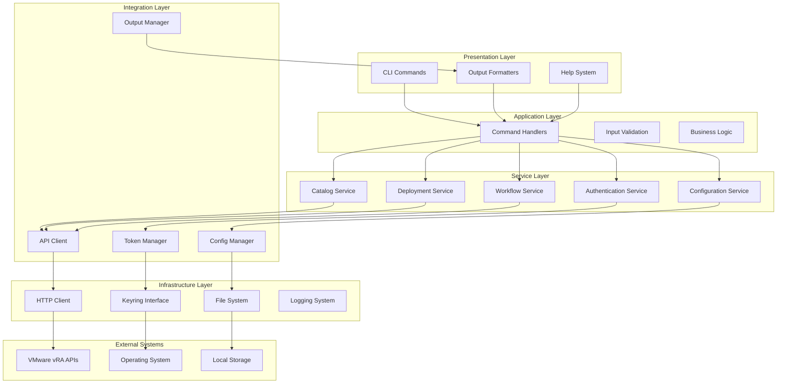

# Architecture Overview

## System Architecture

The VMware vRA CLI follows a layered architecture pattern with clear separation of concerns, promoting maintainability, testability, and extensibility.

## High-Level Architecture



## Architectural Patterns

### 1. Layered Architecture
The system is organized into distinct layers, each with specific responsibilities:

- **Presentation Layer**: User interface and output formatting
- **Application Layer**: Command processing and business logic orchestration
- **Service Layer**: Domain-specific business services
- **Integration Layer**: External system integration and data management
- **Infrastructure Layer**: Low-level technical services

### 2. Command Pattern
CLI commands are implemented using the Command pattern:

```python
class CommandBase:
    """Base class for all CLI commands"""
    
    def execute(self, context: CommandContext) -> CommandResult:
        """Execute the command with given context"""
        pass
    
    def validate(self, args: dict) -> ValidationResult:
        """Validate command arguments"""
        pass
```

### 3. Factory Pattern
Command factories create appropriate command instances:

```python
class CommandFactory:
    """Factory for creating command instances"""
    
    @staticmethod
    def create_command(command_type: str) -> CommandBase:
        """Create command instance based on type"""
        return command_registry.get(command_type)()
```

### 4. Strategy Pattern
Output formatting uses the Strategy pattern:

```python
class OutputStrategy:
    """Base output formatting strategy"""
    
    def format(self, data: dict) -> str:
        """Format data according to strategy"""
        pass

class JSONOutputStrategy(OutputStrategy):
    """JSON output formatting"""
    
class TableOutputStrategy(OutputStrategy):
    """Table output formatting"""
    
class YAMLOutputStrategy(OutputStrategy):
    """YAML output formatting"""
```

## Core Components

### 1. CLI Engine
- **Click Framework Integration**: Leverages Click for command parsing and help generation
- **Command Router**: Routes commands to appropriate handlers
- **Context Management**: Manages execution context across command lifecycle
- **Error Handling**: Centralized error handling and user-friendly error messages

### 2. Authentication System
- **Two-Phase Authentication**: Implements VMware vRA authentication flow
- **Token Management**: Secure token storage and automatic renewal
- **Session Management**: Handles authentication state across CLI sessions
- **Credential Storage**: Secure integration with system keyring

### 3. API Client Layer
- **RESTful Communication**: HTTP/HTTPS communication with vRA APIs
- **Request/Response Handling**: Standardized API request/response processing
- **Error Handling**: API-specific error handling and retry logic
- **Rate Limiting**: Built-in rate limiting and backoff strategies

### 4. Configuration System
- **Hierarchical Configuration**: Environment variables > CLI args > config file > defaults
- **Profile Management**: Support for multiple configuration profiles
- **Persistent Storage**: JSON-based configuration persistence
- **Runtime Configuration**: Dynamic configuration updates during execution

### 5. Output System
- **Multiple Formats**: Support for JSON, YAML, CSV, and tabular output
- **Rich Terminal Output**: Colors, progress bars, and interactive elements
- **Streaming Output**: Support for large dataset streaming
- **Template System**: Custom output templates and formatting

## Design Principles

### 1. Single Responsibility Principle
Each component has a single, well-defined responsibility:
- Commands handle user input and orchestration
- Services encapsulate business logic
- Clients manage external communication
- Managers handle specific cross-cutting concerns

### 2. Open/Closed Principle
The system is designed for extension without modification:
- Plugin architecture for new commands
- Strategy pattern for output formats
- Factory pattern for component creation
- Interface-based design for external integrations

### 3. Dependency Inversion
High-level modules depend on abstractions:
- Service interfaces define contracts
- Repository pattern for data access
- Dependency injection for component wiring
- Mock implementations for testing

### 4. Separation of Concerns
Clear boundaries between different aspects:
- Business logic separated from presentation
- Configuration management isolated from business logic
- Authentication separated from API operations
- Error handling centralized and consistent

## Data Flow Architecture

### 1. Request Flow


### 2. Authentication Flow


### 3. Configuration Flow


## Error Handling Strategy

### 1. Error Categories
- **User Errors**: Invalid input, missing parameters
- **Authentication Errors**: Login failures, token expiration
- **API Errors**: Service unavailable, rate limiting
- **System Errors**: Network issues, file system problems
- **Configuration Errors**: Invalid settings, missing files

### 2. Error Handling Patterns
```python
class ErrorHandler:
    """Centralized error handling"""
    
    def handle_error(self, error: Exception, context: dict) -> ErrorResponse:
        """Process error and return appropriate response"""
        if isinstance(error, AuthenticationError):
            return self._handle_auth_error(error, context)
        elif isinstance(error, APIError):
            return self._handle_api_error(error, context)
        # ... other error types
```

### 3. Recovery Strategies
- **Automatic Retry**: Network timeouts, temporary service issues
- **Token Refresh**: Expired authentication tokens
- **Fallback Options**: Alternative API endpoints, cached data
- **User Guidance**: Helpful error messages with resolution steps

## Performance Considerations

### 1. Caching Strategy
- **Configuration Caching**: Cache loaded configuration data
- **API Response Caching**: Cache frequently accessed data
- **Token Caching**: Cache valid authentication tokens
- **Schema Caching**: Cache API schema definitions

### 2. Async Operations
- **Background Tasks**: Long-running operations in background
- **Progress Tracking**: Real-time progress updates
- **Cancellation Support**: User-initiated operation cancellation
- **Resource Management**: Proper cleanup of resources

### 3. Memory Management
- **Streaming Processing**: Process large datasets incrementally
- **Connection Pooling**: Reuse HTTP connections
- **Resource Cleanup**: Explicit resource disposal
- **Memory Monitoring**: Track memory usage patterns

## Security Architecture

### 1. Authentication Security
- **Secure Token Storage**: System keyring integration
- **Token Encryption**: Additional encryption layer
- **Token Rotation**: Automatic token renewal
- **Session Management**: Secure session handling

### 2. Communication Security
- **TLS/HTTPS**: Encrypted communication channels
- **Certificate Validation**: SSL certificate verification
- **Request Signing**: API request authentication
- **Secure Headers**: Security-focused HTTP headers

### 3. Data Protection
- **Credential Masking**: Mask sensitive data in logs
- **Secure Configuration**: Encrypted configuration storage
- **Memory Protection**: Clear sensitive data from memory
- **Audit Logging**: Security event logging

This architecture provides a solid foundation for the VMware vRA CLI, ensuring scalability, maintainability, and security while delivering excellent user experience.
