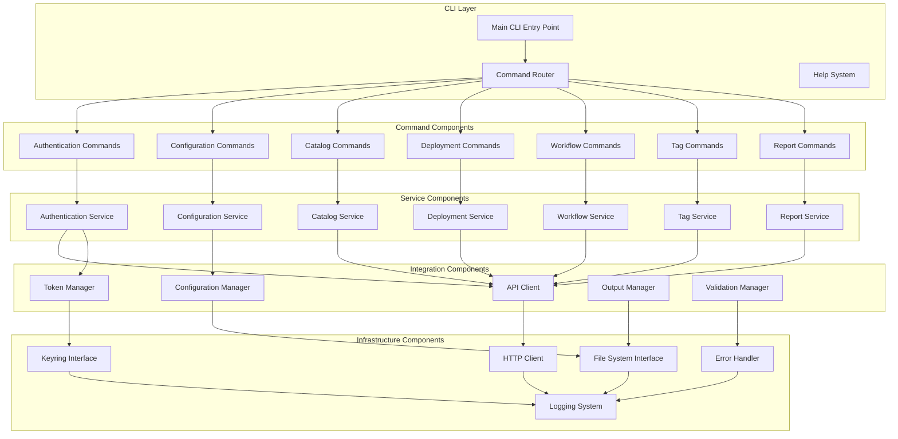
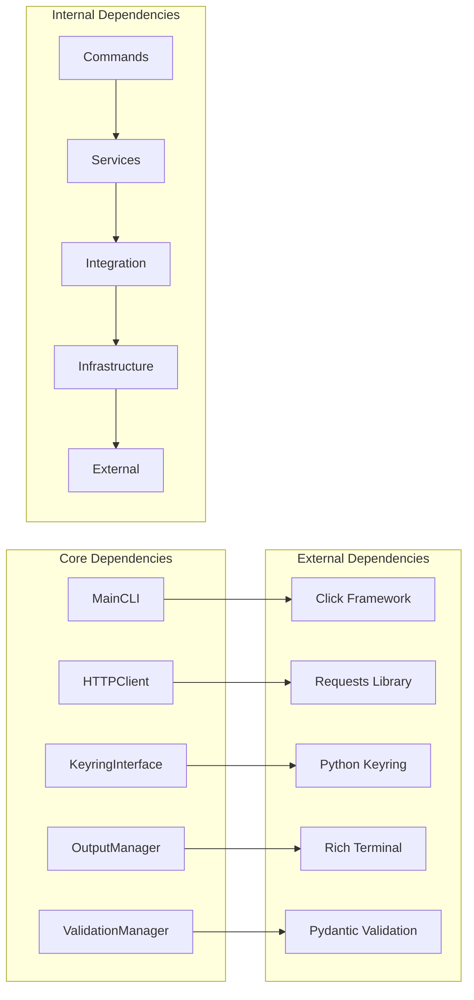

# Components Model

## Component Overview

The VMware vRA CLI is composed of several interconnected components, each with specific responsibilities and well-defined interfaces. This document details the component model, interfaces, and dependencies.

## Component Architecture



## Core Components

### 1. CLI Layer Components

#### Main CLI Entry Point
**Responsibility**: Application bootstrap and initialization

```python
class MainCLI:
    """Main CLI application entry point"""
    
    def __init__(self):
        self.config_manager = ConfigManager()
        self.command_router = CommandRouter()
        self.error_handler = ErrorHandler()
    
    def run(self, args: List[str]) -> int:
        """Execute CLI with provided arguments"""
        pass
    
    def initialize_application(self) -> None:
        """Initialize application components"""
        pass
```

**Dependencies**:
- ConfigManager
- CommandRouter
- ErrorHandler
- LoggingSystem

#### Command Router
**Responsibility**: Route commands to appropriate handlers

```python
class CommandRouter:
    """Routes CLI commands to appropriate handlers"""
    
    def __init__(self):
        self.command_registry = {}
        self.validation_manager = ValidationManager()
    
    def register_command(self, name: str, command_class: Type[CommandBase]) -> None:
        """Register a command with the router"""
        pass
    
    def route_command(self, command_name: str, args: dict) -> CommandResult:
        """Route command to appropriate handler"""
        pass
```

**Dependencies**:
- Command classes
- ValidationManager
- ErrorHandler

### 2. Command Components

#### Authentication Commands
**Responsibility**: Handle authentication-related CLI operations

```python
class AuthenticationCommands:
    """Authentication command handlers"""
    
    def __init__(self, auth_service: AuthService):
        self.auth_service = auth_service
    
    def login(self, url: str, username: str, password: str, tenant: str, domain: str) -> CommandResult:
        """Handle login command"""
        pass
    
    def logout(self) -> CommandResult:
        """Handle logout command"""
        pass
    
    def status(self) -> CommandResult:
        """Handle authentication status command"""
        pass
    
    def refresh(self) -> CommandResult:
        """Handle token refresh command"""
        pass
```

**Dependencies**:
- AuthService
- OutputManager
- ValidationManager

#### Deployment Commands
**Responsibility**: Handle deployment management operations

```python
class DeploymentCommands:
    """Deployment command handlers"""
    
    def __init__(self, deployment_service: DeploymentService):
        self.deployment_service = deployment_service
        self.output_manager = OutputManager()
    
    def list_deployments(self, filters: dict) -> CommandResult:
        """List deployments with optional filtering"""
        pass
    
    def show_deployment(self, deployment_id: str) -> CommandResult:
        """Show detailed deployment information"""
        pass
    
    def export_all(self, names: List[str], tags: List[str], output_format: str) -> CommandResult:
        """Export multiple deployments"""
        pass
    
    def delete_deployment(self, deployment_id: str) -> CommandResult:
        """Delete a deployment"""
        pass
```

**Dependencies**:
- DeploymentService
- OutputManager
- ValidationManager

### 3. Service Components

#### Authentication Service
**Responsibility**: Manage authentication flows and token lifecycle

```python
class AuthService:
    """Authentication service for VMware vRA"""
    
    def __init__(self, api_client: APIClient, token_manager: TokenManager):
        self.api_client = api_client
        self.token_manager = token_manager
        self.authenticator = VRAAuthenticator()
    
    def authenticate(self, credentials: AuthCredentials) -> AuthResult:
        """Perform two-phase authentication"""
        pass
    
    def refresh_token(self) -> TokenResult:
        """Refresh expired access token"""
        pass
    
    def logout(self) -> bool:
        """Clear authentication state"""
        pass
    
    def get_auth_status(self) -> AuthStatus:
        """Get current authentication status"""
        pass
```

**Dependencies**:
- APIClient
- TokenManager
- VRAAuthenticator

#### Deployment Service
**Responsibility**: Manage deployment operations and data processing

```python
class DeploymentService:
    """Deployment management service"""
    
    def __init__(self, api_client: APIClient):
        self.api_client = api_client
        self.deployment_processor = DeploymentProcessor()
    
    def get_deployments(self, filters: DeploymentFilters) -> List[Deployment]:
        """Retrieve deployments with filtering"""
        pass
    
    def get_deployment_details(self, deployment_id: str) -> DeploymentDetails:
        """Get detailed deployment information"""
        pass
    
    def export_deployments(self, criteria: ExportCriteria) -> ExportResult:
        """Export deployments based on criteria"""
        pass
    
    def delete_deployment(self, deployment_id: str) -> bool:
        """Delete deployment"""
        pass
```

**Dependencies**:
- APIClient
- DeploymentProcessor
- DataValidator

### 4. Integration Components

#### API Client
**Responsibility**: Handle HTTP communication with VMware vRA APIs

```python
class APIClient:
    """VMware vRA API client"""
    
    def __init__(self, http_client: HTTPClient, token_manager: TokenManager):
        self.http_client = http_client
        self.token_manager = token_manager
        self.rate_limiter = RateLimiter()
    
    def get(self, endpoint: str, params: dict = None) -> APIResponse:
        """Execute GET request"""
        pass
    
    def post(self, endpoint: str, data: dict = None) -> APIResponse:
        """Execute POST request"""
        pass
    
    def put(self, endpoint: str, data: dict = None) -> APIResponse:
        """Execute PUT request"""
        pass
    
    def delete(self, endpoint: str) -> APIResponse:
        """Execute DELETE request"""
        pass
```

**Dependencies**:
- HTTPClient
- TokenManager
- RateLimiter
- RequestValidator

#### Token Manager
**Responsibility**: Secure token storage and lifecycle management

```python
class TokenManager:
    """Secure token management"""
    
    def __init__(self, keyring_interface: KeyringInterface):
        self.keyring = keyring_interface
        self.token_cache = {}
    
    def store_tokens(self, tokens: TokenSet) -> bool:
        """Store tokens securely"""
        pass
    
    def get_access_token(self) -> Optional[str]:
        """Retrieve valid access token"""
        pass
    
    def get_refresh_token(self) -> Optional[str]:
        """Retrieve refresh token"""
        pass
    
    def clear_tokens(self) -> bool:
        """Clear all stored tokens"""
        pass
    
    def is_token_valid(self, token: str) -> bool:
        """Check token validity"""
        pass
```

**Dependencies**:
- KeyringInterface
- TokenValidator
- EncryptionService

#### Configuration Manager
**Responsibility**: Manage application configuration and profiles

```python
class ConfigManager:
    """Configuration management"""
    
    def __init__(self, file_system: FileSystemInterface):
        self.file_system = file_system
        self.config_cache = {}
        self.config_validator = ConfigValidator()
    
    def load_configuration(self, profile: str = None) -> Configuration:
        """Load configuration with profile support"""
        pass
    
    def save_configuration(self, config: Configuration, profile: str = None) -> bool:
        """Save configuration to file"""
        pass
    
    def merge_configurations(self, *configs: Configuration) -> Configuration:
        """Merge multiple configuration sources"""
        pass
    
    def validate_configuration(self, config: Configuration) -> ValidationResult:
        """Validate configuration settings"""
        pass
```

**Dependencies**:
- FileSystemInterface
- ConfigValidator
- EnvironmentReader

### 5. Infrastructure Components

#### HTTP Client
**Responsibility**: Low-level HTTP communication and connection management

```python
class HTTPClient:
    """HTTP client with advanced features"""
    
    def __init__(self):
        self.session = requests.Session()
        self.retry_strategy = RetryStrategy()
        self.connection_pool = ConnectionPool()
    
    def request(self, method: str, url: str, **kwargs) -> HTTPResponse:
        """Execute HTTP request with retry logic"""
        pass
    
    def configure_ssl(self, ssl_config: SSLConfig) -> None:
        """Configure SSL/TLS settings"""
        pass
    
    def set_timeout(self, timeout: int) -> None:
        """Set request timeout"""
        pass
```

**Dependencies**:
- RetryStrategy
- ConnectionPool
- SSLValidator

#### Keyring Interface
**Responsibility**: Cross-platform secure credential storage

```python
class KeyringInterface:
    """Cross-platform keyring abstraction"""
    
    def __init__(self):
        self.keyring_backend = self._detect_keyring_backend()
    
    def store_credential(self, service: str, username: str, password: str) -> bool:
        """Store credential securely"""
        pass
    
    def get_credential(self, service: str, username: str) -> Optional[str]:
        """Retrieve stored credential"""
        pass
    
    def delete_credential(self, service: str, username: str) -> bool:
        """Delete stored credential"""
        pass
    
    def _detect_keyring_backend(self) -> KeyringBackend:
        """Detect appropriate keyring backend"""
        pass
```

**Dependencies**:
- Platform-specific keyring backends
- CredentialValidator

## Component Interfaces

### Base Interfaces

#### CommandBase Interface
```python
class CommandBase(ABC):
    """Base interface for all commands"""
    
    @abstractmethod
    def execute(self, context: CommandContext) -> CommandResult:
        """Execute command with given context"""
        pass
    
    @abstractmethod
    def validate(self, args: dict) -> ValidationResult:
        """Validate command arguments"""
        pass
    
    @abstractmethod
    def get_help(self) -> str:
        """Get command help text"""
        pass
```

#### ServiceBase Interface
```python
class ServiceBase(ABC):
    """Base interface for all services"""
    
    @abstractmethod
    def initialize(self) -> bool:
        """Initialize service"""
        pass
    
    @abstractmethod
    def cleanup(self) -> None:
        """Cleanup service resources"""
        pass
    
    @abstractmethod
    def health_check(self) -> HealthStatus:
        """Check service health"""
        pass
```

#### OutputFormatter Interface
```python
class OutputFormatter(ABC):
    """Interface for output formatting strategies"""
    
    @abstractmethod
    def format(self, data: Any, options: FormatOptions) -> str:
        """Format data according to strategy"""
        pass
    
    @abstractmethod
    def supports_streaming(self) -> bool:
        """Check if formatter supports streaming output"""
        pass
```

## Dependency Graph



## Component Lifecycle

### 1. Initialization Phase
```python
def initialize_application():
    """Initialize application components in dependency order"""
    
    # 1. Infrastructure components
    logging_system = LoggingSystem()
    error_handler = ErrorHandler(logging_system)
    
    # 2. Integration components
    file_system = FileSystemInterface()
    keyring = KeyringInterface()
    http_client = HTTPClient()
    
    # 3. Manager components
    config_manager = ConfigManager(file_system)
    token_manager = TokenManager(keyring)
    
    # 4. Service components
    api_client = APIClient(http_client, token_manager)
    auth_service = AuthService(api_client, token_manager)
    
    # 5. Command components
    command_router = CommandRouter()
    command_router.register_commands()
    
    # 6. CLI application
    main_cli = MainCLI(command_router, config_manager, error_handler)
    
    return main_cli
```

### 2. Execution Phase
```python
def execute_command(command_name: str, args: dict):
    """Execute command with proper lifecycle management"""
    
    try:
        # Validate inputs
        validation_result = validate_command(command_name, args)
        
        # Route to appropriate handler
        command = command_router.get_command(command_name)
        
        # Execute with context
        context = CommandContext(args, config, auth_state)
        result = command.execute(context)
        
        # Format and display output
        formatted_output = output_manager.format(result)
        display_output(formatted_output)
        
    except Exception as e:
        error_handler.handle_error(e, context)
```

### 3. Cleanup Phase
```python
def cleanup_application():
    """Cleanup application components"""
    
    # Clear sensitive data
    token_manager.clear_cache()
    
    # Close connections
    http_client.close_connections()
    
    # Flush logs
    logging_system.flush()
    
    # Release resources
    resource_manager.release_all()
```

This component model provides a clear structure for understanding the VMware vRA CLI architecture, component responsibilities, and their interactions within the system.
