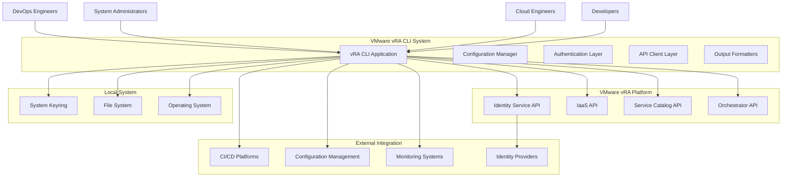

# Context Diagram

## System Context Overview

The VMware vRA CLI operates within a complex enterprise environment, interacting with multiple external systems and serving various user personas. This context diagram illustrates the high-level relationships and boundaries of the system.

## External Actors and Systems

### Primary Actors

#### 1. End Users
- **DevOps Engineers**: Automate infrastructure provisioning and management
- **System Administrators**: Manage vRA environments and deployments  
- **Cloud Engineers**: Orchestrate multi-cloud deployments
- **Developers**: Integrate CLI into CI/CD pipelines and automation scripts

#### 2. VMware vRealize Automation Platform
- **Identity Service API**: Authentication and authorization services
- **IaaS API**: Infrastructure as a Service management
- **Service Catalog API**: Blueprint and catalog item management
- **Orchestrator API**: Workflow execution and management

#### 3. External Systems Integration
- **CI/CD Platforms**: Jenkins, GitLab CI, GitHub Actions, Azure DevOps
- **Configuration Management**: Ansible, Puppet, Chef
- **Monitoring Systems**: VMware vRealize Operations, third-party monitoring
- **Identity Providers**: Active Directory, LDAP, SAML providers

### Supporting Systems

#### 4. Local System Resources
- **Operating System**: Windows, macOS, Linux
- **System Keyring**: Secure credential storage (Windows Credential Manager, macOS Keychain, Linux Secret Service)
- **File System**: Configuration files, logs, temporary data
- **Network Stack**: HTTPS/TLS communications

#### 5. Development and Distribution
- **Package Repositories**: PyPI for Python package distribution
- **Version Control**: Git repositories for source code
- **Documentation Hosting**: MkDocs sites, GitHub Pages

## System Boundaries

## Context Boundaries

### 1. Primary System Boundary
The **VMware vRA CLI System** encompasses:
- Command-line interface application
- Configuration management subsystem
- Authentication and authorization components
- API communication layer
- Output formatting and display logic

### 2. External Service Boundary
**VMware vRealize Automation Platform** provides:
- Identity and access management services
- Infrastructure provisioning APIs
- Service catalog and blueprint management
- Workflow orchestration capabilities

### 3. Local System Boundary
**Local Operating Environment** includes:
- Secure credential storage mechanisms
- File system access for configuration and logs
- Network connectivity for API communications
- Process execution environment

### 4. Integration Boundary
**External Integration Points** support:
- Automation pipeline integration
- Configuration management tool connectivity
- Monitoring and observability integration
- Enterprise identity provider connectivity

## Data Flows

### Authentication Flow
1. User initiates login through CLI
2. CLI communicates with vRA Identity Service
3. Credentials validated against Identity Provider
4. Tokens stored securely in system keyring
5. Subsequent API calls use stored tokens

### API Operations Flow
1. User executes CLI command
2. CLI retrieves stored authentication tokens
3. API request constructed and sent to vRA platform
4. Response processed and formatted
5. Results displayed to user in requested format

### Configuration Management Flow
1. CLI reads configuration from local file system
2. Environment variables override file-based settings
3. Command-line parameters override all other sources
4. Configuration changes persisted to local storage

## Security Boundaries

### Trust Boundaries
- **User to CLI**: Local system trust
- **CLI to vRA Platform**: Authenticated HTTPS/TLS
- **CLI to System Keyring**: OS-mediated secure storage
- **CLI to File System**: Standard OS file permissions

### Security Zones
- **User Zone**: Terminal/shell environment
- **Application Zone**: CLI process space
- **Local System Zone**: OS-protected storage
- **Network Zone**: Encrypted network communications
- **Remote Zone**: VMware vRA platform services

## Integration Patterns

### 1. Command-Line Integration
- Direct terminal execution
- Shell scripting integration
- Process automation workflows

### 2. Pipeline Integration  
- CI/CD step execution
- Automated deployment workflows
- Infrastructure as Code integration

### 3. API Integration
- RESTful API communication
- Token-based authentication
- JSON/YAML data exchange

### 4. Configuration Integration
- Environment variable configuration
- Configuration file management
- Profile-based settings

This context diagram establishes the system boundaries and external relationships that inform the detailed architecture and component design decisions documented in the following sections.
