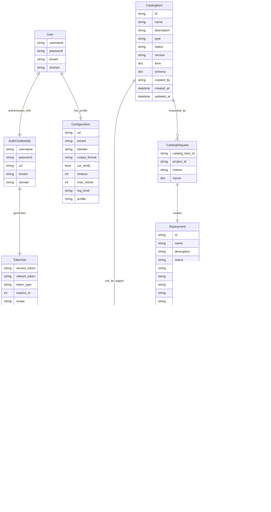

# Data Models

## Overview

This document defines the data models, schemas, and object structures used throughout the VMware vRA CLI application. These models ensure type safety, data validation, and consistent API interactions.

## Data Model Schema Diagrams

### Core Entity Relationship Diagram



### Authentication Flow Schema


### Deployment Lifecycle Schema


### Data Validation Hierarchy


## Core Data Models

### 1. Authentication Models

#### AuthCredentials
```python
@dataclass
class AuthCredentials:
    """User authentication credentials"""
    username: str
    password: str
    url: str
    tenant: str
    domain: str = "vsphere.local"
    
    def __post_init__(self):
        """Validate credentials after initialization"""
        if not all([self.username, self.password, self.url, self.tenant]):
            raise ValueError("All credential fields are required")
```

#### TokenSet
```python
@dataclass
class TokenSet:
    """Authentication token set"""
    access_token: str
    refresh_token: str
    token_type: str = "Bearer"
    expires_in: int = 28800  # 8 hours
    scope: Optional[str] = None
    
    @property
    def expires_at(self) -> datetime:
        """Calculate token expiration time"""
        return datetime.utcnow() + timedelta(seconds=self.expires_in)
    
    @property
    def is_expired(self) -> bool:
        """Check if token is expired"""
        return datetime.utcnow() > self.expires_at
```

#### AuthStatus
```python
@dataclass
class AuthStatus:
    """Current authentication status"""
    is_authenticated: bool
    username: Optional[str] = None
    tenant: Optional[str] = None
    domain: Optional[str] = None
    expires_at: Optional[datetime] = None
    token_valid: bool = False
    
    def to_dict(self) -> Dict[str, Any]:
        """Convert to dictionary for output"""
        return asdict(self)
```

### 2. Configuration Models

#### Configuration
```python
@dataclass
class Configuration:
    """Application configuration"""
    url: Optional[str] = None
    tenant: Optional[str] = None
    domain: str = "vsphere.local"
    output_format: str = "table"
    ssl_verify: bool = True
    timeout: int = 30
    max_retries: int = 3
    log_level: str = "INFO"
    profile: str = "default"
    
    @classmethod
    def from_dict(cls, data: Dict[str, Any]) -> 'Configuration':
        """Create configuration from dictionary"""
        return cls(**{k: v for k, v in data.items() if k in cls.__annotations__})
    
    def merge(self, other: 'Configuration') -> 'Configuration':
        """Merge with another configuration, preferring non-None values"""
        merged_data = asdict(self)
        for key, value in asdict(other).items():
            if value is not None:
                merged_data[key] = value
        return Configuration.from_dict(merged_data)
```

#### ConfigProfile
```python
@dataclass
class ConfigProfile:
    """Named configuration profile"""
    name: str
    config: Configuration
    description: Optional[str] = None
    created_at: datetime = field(default_factory=datetime.utcnow)
    updated_at: datetime = field(default_factory=datetime.utcnow)
    
    def update_config(self, updates: Dict[str, Any]) -> None:
        """Update configuration with new values"""
        for key, value in updates.items():
            if hasattr(self.config, key):
                setattr(self.config, key, value)
        self.updated_at = datetime.utcnow()
```

### 3. Catalog Models

#### CatalogItem
```python
@dataclass
class CatalogItem:
    """Service catalog item"""
    id: str
    name: str
    description: Optional[str] = None
    type: str = "Blueprint"
    status: str = "RELEASED"
    version: str = "1.0"
    form: Optional[Dict[str, Any]] = None
    schema: Optional[Dict[str, Any]] = None
    created_by: Optional[str] = None
    created_at: Optional[datetime] = None
    updated_at: Optional[datetime] = None
    
    @property
    def is_requestable(self) -> bool:
        """Check if item can be requested"""
        return self.status == "RELEASED"
```

#### CatalogRequest
```python
@dataclass
class CatalogRequest:
    """Request for catalog item"""
    catalog_item_id: str
    project_id: str
    reason: str
    inputs: Dict[str, Any] = field(default_factory=dict)
    
    def add_input(self, key: str, value: Any) -> None:
        """Add input parameter"""
        self.inputs[key] = value
    
    def validate_inputs(self, schema: Dict[str, Any]) -> bool:
        """Validate inputs against schema"""
        # Implementation for schema validation
        return True
```

### 4. Deployment Models

#### Deployment
```python
@dataclass
class Deployment:
    """VMware vRA deployment"""
    id: str
    name: str
    description: Optional[str] = None
    status: str = "CREATE_SUCCESSFUL"
    project_id: str = ""
    project_name: Optional[str] = None
    blueprint_id: Optional[str] = None
    blueprint_name: Optional[str] = None
    created_by: Optional[str] = None
    created_at: Optional[datetime] = None
    updated_at: Optional[datetime] = None
    lease_expire_at: Optional[datetime] = None
    inputs: Dict[str, Any] = field(default_factory=dict)
    
    @property
    def is_expired(self) -> bool:
        """Check if deployment lease is expired"""
        return (self.lease_expire_at and 
                datetime.utcnow() > self.lease_expire_at)
    
    @property
    def days_until_expiry(self) -> Optional[int]:
        """Days until deployment expires"""
        if not self.lease_expire_at:
            return None
        delta = self.lease_expire_at - datetime.utcnow()
        return max(0, delta.days)
```

#### DeploymentResource
```python
@dataclass
class DeploymentResource:
    """Resource within a deployment"""
    id: str
    name: str
    type: str
    status: str
    deployment_id: str
    properties: Dict[str, Any] = field(default_factory=dict)
    
    @property
    def is_vm(self) -> bool:
        """Check if resource is a virtual machine"""
        return self.type.lower() in ["cloud.machine", "virtualmachine"]
    
    @property
    def ip_address(self) -> Optional[str]:
        """Get IP address if available"""
        return self.properties.get("address") or self.properties.get("networks", [{}])[0].get("address")
```

#### DeploymentFilters
```python
@dataclass
class DeploymentFilters:
    """Filters for deployment queries"""
    names: Optional[List[str]] = None
    tags: Optional[List[str]] = None
    status: Optional[List[str]] = None
    project_ids: Optional[List[str]] = None
    created_after: Optional[datetime] = None
    created_before: Optional[datetime] = None
    expires_before: Optional[datetime] = None
    
    def to_api_params(self) -> Dict[str, str]:
        """Convert to API query parameters"""
        params = {}
        if self.names:
            params['names'] = ','.join(self.names)
        if self.status:
            params['status'] = ','.join(self.status)
        if self.project_ids:
            params['projects'] = ','.join(self.project_ids)
        return params
```

### 5. Tag Models

#### Tag
```python
@dataclass
class Tag:
    """Resource tag"""
    key: str
    value: str
    
    def __str__(self) -> str:
        return f"{self.key}:{self.value}"
    
    @classmethod
    def from_string(cls, tag_string: str) -> 'Tag':
        """Parse tag from string format 'key:value'"""
        if ':' not in tag_string:
            raise ValueError(f"Invalid tag format: {tag_string}")
        key, value = tag_string.split(':', 1)
        return cls(key=key.strip(), value=value.strip())
```

#### TaggedResource
```python
@dataclass
class TaggedResource:
    """Resource with associated tags"""
    resource_id: str
    resource_type: str
    tags: List[Tag] = field(default_factory=list)
    
    def add_tag(self, tag: Tag) -> None:
        """Add a tag to the resource"""
        if tag not in self.tags:
            self.tags.append(tag)
    
    def remove_tag(self, key: str, value: str = None) -> bool:
        """Remove tag(s) by key and optionally value"""
        removed = False
        self.tags = [tag for tag in self.tags 
                    if not (tag.key == key and (value is None or tag.value == value))]
        return removed
    
    def has_tag(self, key: str, value: str = None) -> bool:
        """Check if resource has specified tag"""
        return any(tag.key == key and (value is None or tag.value == value) 
                  for tag in self.tags)
```

### 6. Workflow Models

#### WorkflowExecution
```python
@dataclass
class WorkflowExecution:
    """Workflow execution instance"""
    id: str
    workflow_id: str
    name: str
    status: str = "RUNNING"
    start_time: Optional[datetime] = None
    end_time: Optional[datetime] = None
    inputs: Dict[str, Any] = field(default_factory=dict)
    outputs: Dict[str, Any] = field(default_factory=dict)
    error_message: Optional[str] = None
    
    @property
    def is_completed(self) -> bool:
        """Check if workflow execution is completed"""
        return self.status in ["COMPLETED", "FAILED", "CANCELED"]
    
    @property
    def duration(self) -> Optional[timedelta]:
        """Calculate execution duration"""
        if self.start_time and self.end_time:
            return self.end_time - self.start_time
        return None
```

#### WorkflowDefinition
```python
@dataclass
class WorkflowDefinition:
    """Workflow definition"""
    id: str
    name: str
    description: Optional[str] = None
    version: str = "1.0.0"
    input_parameters: List[Dict[str, Any]] = field(default_factory=list)
    output_parameters: List[Dict[str, Any]] = field(default_factory=list)
    
    def get_input_parameter(self, name: str) -> Optional[Dict[str, Any]]:
        """Get input parameter definition by name"""
        return next((param for param in self.input_parameters if param.get('name') == name), None)
```

### 7. API Response Models

#### APIResponse
```python
@dataclass
class APIResponse:
    """Generic API response wrapper"""
    status_code: int
    data: Any = None
    error: Optional[str] = None
    headers: Dict[str, str] = field(default_factory=dict)
    
    @property
    def is_success(self) -> bool:
        """Check if response indicates success"""
        return 200 <= self.status_code < 300
    
    @property
    def is_error(self) -> bool:
        """Check if response indicates error"""
        return self.status_code >= 400
```

#### PaginatedResponse
```python
@dataclass
class PaginatedResponse:
    """Paginated API response"""
    content: List[Any] = field(default_factory=list)
    total_elements: int = 0
    total_pages: int = 0
    page: int = 0
    size: int = 20
    
    @property
    def has_more_pages(self) -> bool:
        """Check if more pages are available"""
        return self.page < self.total_pages - 1
    
    def get_next_page_number(self) -> Optional[int]:
        """Get next page number if available"""
        return self.page + 1 if self.has_more_pages else None
```

### 8. Export Models

#### ExportCriteria
```python
@dataclass
class ExportCriteria:
    """Criteria for export operations"""
    names: Optional[List[str]] = None
    tags: Optional[List[str]] = None
    include_resources: bool = False
    output_format: str = "json"
    output_file: Optional[str] = None
    
    def matches_deployment(self, deployment: Deployment, tagged_resource: TaggedResource) -> bool:
        """Check if deployment matches export criteria"""
        # Name matching
        if self.names:
            if not any(name.lower() in deployment.name.lower() for name in self.names):
                return False
        
        # Tag matching
        if self.tags:
            deployment_tags = [str(tag) for tag in tagged_resource.tags]
            if not any(tag in deployment_tags for tag in self.tags):
                return False
                
        return True
```

#### ExportResult
```python
@dataclass
class ExportResult:
    """Result of export operation"""
    total_deployments: int
    exported_deployments: int
    skipped_deployments: int
    export_file: Optional[str] = None
    errors: List[str] = field(default_factory=list)
    
    @property
    def success_rate(self) -> float:
        """Calculate success rate percentage"""
        if self.total_deployments == 0:
            return 100.0
        return (self.exported_deployments / self.total_deployments) * 100
```

## Data Validation

### Pydantic Models

For advanced validation, the CLI uses Pydantic models:

```python
from pydantic import BaseModel, validator, Field
from typing import Optional, List
from datetime import datetime

class DeploymentModel(BaseModel):
    """Pydantic model for deployment validation"""
    id: str = Field(..., min_length=1)
    name: str = Field(..., min_length=1, max_length=255)
    status: str = Field(..., regex=r'^[A-Z_]+$')
    project_id: str = Field(..., min_length=1)
    created_at: Optional[datetime] = None
    
    @validator('name')
    def validate_name(cls, v):
        """Validate deployment name"""
        if not v or v.isspace():
            raise ValueError('Deployment name cannot be empty')
        return v.strip()
    
    @validator('status')
    def validate_status(cls, v):
        """Validate deployment status"""
        valid_statuses = ['CREATE_SUCCESSFUL', 'CREATE_FAILED', 'UPDATE_SUCCESSFUL', 'DELETE_SUCCESSFUL']
        if v not in valid_statuses:
            raise ValueError(f'Invalid status: {v}')
        return v
```

## Schema Definitions

### JSON Schemas

#### Deployment Schema
```json
{
  "$schema": "http://json-schema.org/draft-07/schema#",
  "type": "object",
  "title": "Deployment",
  "required": ["id", "name", "status", "project_id"],
  "properties": {
    "id": {
      "type": "string",
      "minLength": 1
    },
    "name": {
      "type": "string",
      "minLength": 1,
      "maxLength": 255
    },
    "description": {
      "type": ["string", "null"]
    },
    "status": {
      "type": "string",
      "enum": ["CREATE_SUCCESSFUL", "CREATE_FAILED", "UPDATE_SUCCESSFUL", "DELETE_SUCCESSFUL"]
    },
    "project_id": {
      "type": "string",
      "minLength": 1
    },
    "created_at": {
      "type": "string",
      "format": "date-time"
    },
    "inputs": {
      "type": "object"
    }
  }
}
```

#### Configuration Schema
```json
{
  "$schema": "http://json-schema.org/draft-07/schema#",
  "type": "object",
  "title": "Configuration",
  "properties": {
    "url": {
      "type": ["string", "null"],
      "format": "uri"
    },
    "tenant": {
      "type": ["string", "null"],
      "minLength": 1
    },
    "domain": {
      "type": "string",
      "default": "vsphere.local"
    },
    "output_format": {
      "type": "string",
      "enum": ["table", "json", "yaml", "csv"],
      "default": "table"
    },
    "ssl_verify": {
      "type": "boolean",
      "default": true
    },
    "timeout": {
      "type": "integer",
      "minimum": 1,
      "maximum": 300,
      "default": 30
    }
  }
}
```

## Data Transformation

### Model Converters

```python
class ModelConverter:
    """Convert between different model representations"""
    
    @staticmethod
    def deployment_to_dict(deployment: Deployment) -> Dict[str, Any]:
        """Convert deployment model to dictionary"""
        result = asdict(deployment)
        # Convert datetime objects to ISO strings
        for key, value in result.items():
            if isinstance(value, datetime):
                result[key] = value.isoformat() if value else None
        return result
    
    @staticmethod
    def dict_to_deployment(data: Dict[str, Any]) -> Deployment:
        """Convert dictionary to deployment model"""
        # Convert ISO strings to datetime objects
        datetime_fields = ['created_at', 'updated_at', 'lease_expire_at']
        for field in datetime_fields:
            if field in data and data[field]:
                data[field] = datetime.fromisoformat(data[field].replace('Z', '+00:00'))
        return Deployment(**data)
```

### Serialization

```python
class DataSerializer:
    """Serialize data models to various formats"""
    
    def to_json(self, data: Any, indent: int = 2) -> str:
        """Serialize to JSON"""
        return json.dumps(data, indent=indent, default=self._json_serializer)
    
    def to_yaml(self, data: Any) -> str:
        """Serialize to YAML"""
        return yaml.dump(data, default_flow_style=False, default=self._yaml_serializer)
    
    def to_csv(self, data: List[Dict[str, Any]], fieldnames: List[str] = None) -> str:
        """Serialize to CSV"""
        if not data:
            return ""
        
        output = io.StringIO()
        fieldnames = fieldnames or list(data[0].keys())
        writer = csv.DictWriter(output, fieldnames=fieldnames)
        writer.writeheader()
        writer.writerows(data)
        return output.getvalue()
    
    def _json_serializer(self, obj: Any) -> Any:
        """JSON serialization helper"""
        if isinstance(obj, datetime):
            return obj.isoformat()
        elif isinstance(obj, (Deployment, Tag, CatalogItem)):
            return asdict(obj)
        raise TypeError(f"Object of type {type(obj)} is not JSON serializable")
    
    def _yaml_serializer(self, dumper, data):
        """YAML serialization helper"""
        if isinstance(data, datetime):
            return dumper.represent_scalar('tag:yaml.org,2002:timestamp', data.isoformat())
        return dumper.represent_data(data)
```

This comprehensive data model documentation ensures type safety, validation, and consistent data handling throughout the VMware vRA CLI application.
