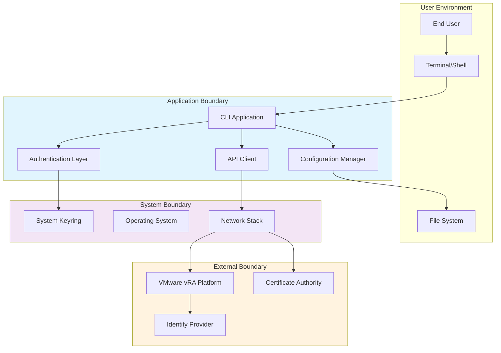
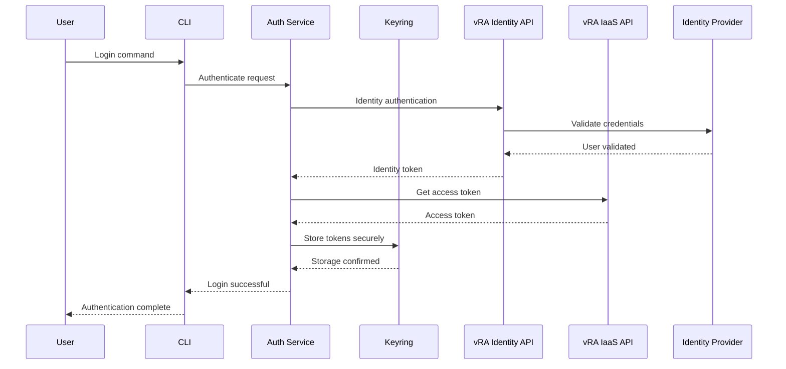

# Security and Compliance

## Overview

This document outlines the security architecture, threat model, and compliance requirements for the VMware vRA CLI. It defines security controls, data protection measures, and compliance considerations necessary for enterprise deployment.

## Security Architecture

### 1. Trust Boundaries



### 2. Security Zones

#### Zone 1: User Space (Lowest Trust)
- Terminal environment and user input
- Configuration files and logs
- Temporary data storage

#### Zone 2: Application Space (Medium Trust)
- CLI application process
- In-memory data processing
- Configuration management

#### Zone 3: System Space (High Trust)
- System keyring services
- Operating system APIs
- Network communication stack

#### Zone 4: External Services (Variable Trust)
- VMware vRA APIs (High Trust)
- Identity providers (High Trust)
- Certificate authorities (High Trust)
- Network infrastructure (Medium Trust)

## Authentication and Authorization

### 1. Authentication Flow



### 2. Token Management

#### Token Types
- **Identity Token**: Initial authentication token from vRA Identity service
- **Access Token**: API access token with 8-hour expiration
- **Refresh Token**: Long-lived token for access token renewal (90 days)

#### Security Controls
- **Secure Storage**: All tokens stored in system keyring with encryption
- **Automatic Expiration**: Tokens automatically expire and require renewal
- **Scope Limitation**: Tokens limited to minimum required permissions
- **Revocation Support**: Tokens can be revoked on logout or security events

### 3. Multi-Factor Authentication (MFA)

- **Support**: CLI supports MFA when required by vRA environment
- **Flow**: MFA prompts handled through interactive authentication
- **Tokens**: MFA-protected tokens stored with additional encryption layer
- **Validation**: MFA requirements validated before each authentication attempt

## Data Protection

### 1. Data Classification

#### Highly Sensitive Data
- Authentication credentials (passwords, tokens)
- Private keys and certificates
- Personal identifiable information (PII)

#### Sensitive Data
- Configuration settings with connection details
- API responses containing system information
- Audit logs and access records

#### Internal Data
- Application logs and debug information
- Performance metrics and statistics
- Non-sensitive configuration data

#### Public Data
- Help documentation and command syntax
- Error messages without sensitive details
- Version and system information

### 2. Encryption Requirements

#### Data at Rest
- **Keyring Storage**: System keyring provides hardware-backed encryption where available
- **Configuration Files**: Sensitive configuration data encrypted using AES-256
- **Log Files**: Audit logs encrypted and protected with restricted access
- **Cache Data**: Temporary data encrypted and automatically purged

#### Data in Transit
- **TLS Encryption**: All network communications use TLS 1.2 or higher
- **Certificate Validation**: SSL certificates validated against trusted CAs
- **Perfect Forward Secrecy**: Ephemeral key exchange for session security
- **HSTS Support**: HTTP Strict Transport Security enforced where supported

### 3. Key Management

#### Key Storage
- **System Integration**: Leverage platform native key storage (Windows Credential Manager, macOS Keychain, Linux Secret Service)
- **Encryption Keys**: Application encryption keys derived from user credentials and system entropy
- **Key Rotation**: Support for key rotation and migration procedures

#### Key Lifecycle
- **Generation**: Cryptographically secure random key generation
- **Distribution**: Keys never transmitted in plain text
- **Storage**: Keys protected with hardware security modules where available
- **Destruction**: Secure key deletion on logout or application removal

## Secure Communication

### 1. Network Security

#### TLS Configuration
```python
# Example TLS configuration
SSL_CONFIG = {
    'ssl_version': ssl.PROTOCOL_TLS_CLIENT,
    'cert_reqs': ssl.CERT_REQUIRED,
    'check_hostname': True,
    'ciphers': 'ECDHE+AESGCM:ECDHE+CHACHA20:DHE+AESGCM:DHE+CHACHA20:!aNULL:!MD5:!DSS',
    'options': ssl.OP_NO_SSLv2 | ssl.OP_NO_SSLv3 | ssl.OP_NO_TLSv1 | ssl.OP_NO_TLSv1_1
}
```

#### Certificate Validation
- **Chain Validation**: Complete certificate chain verification
- **Revocation Checking**: OCSP and CRL validation where supported
- **Pinning**: Certificate pinning for critical endpoints
- **Custom CAs**: Support for enterprise certificate authorities

### 2. API Security

#### Request Security
- **Authentication Headers**: Bearer token authentication for all API calls
- **Request Signing**: Optional request signing for enhanced security
- **Rate Limiting**: Built-in rate limiting to prevent abuse
- **Timeout Protection**: Request timeouts to prevent hanging connections

#### Response Validation
- **Content Validation**: Response content validation against expected schemas
- **Size Limits**: Maximum response size limits to prevent DoS attacks
- **Content-Type Checking**: Strict content-type validation for all responses

## Threat Model

### 1. Threat Actors

#### External Attackers
- **Capabilities**: Remote network access, social engineering
- **Motivations**: Data theft, system disruption, credential harvesting
- **Attack Vectors**: Network interception, phishing, malware

#### Malicious Insiders
- **Capabilities**: Legitimate system access, elevated privileges
- **Motivations**: Data exfiltration, sabotage, unauthorized access
- **Attack Vectors**: Privilege abuse, data copying, backdoor installation

#### Compromised Accounts
- **Capabilities**: Legitimate user credentials, normal access patterns
- **Motivations**: Lateral movement, persistence, data collection
- **Attack Vectors**: Credential stuffing, session hijacking, token theft

### 2. Attack Scenarios

#### Scenario 1: Credential Theft
- **Attack**: Attacker attempts to steal stored credentials
- **Impact**: Unauthorized access to vRA environment
- **Mitigations**: 
  - System keyring encryption
  - Token expiration and rotation
  - Multi-factor authentication
  - Access monitoring and alerting

#### Scenario 2: Man-in-the-Middle
- **Attack**: Attacker intercepts network communications
- **Impact**: Credential interception, data manipulation
- **Mitigations**:
  - TLS encryption with certificate pinning
  - Certificate validation and HSTS
  - Network segmentation
  - VPN requirements for remote access

#### Scenario 3: Configuration Tampering
- **Attack**: Attacker modifies configuration to redirect API calls
- **Impact**: Data exfiltration, unauthorized system access
- **Mitigations**:
  - Configuration file integrity checking
  - Restricted file system permissions
  - Configuration validation
  - Audit logging of configuration changes

### 3. Risk Assessment Matrix

| Threat | Likelihood | Impact | Risk Level | Mitigation Priority |
|--------|------------|--------|------------|-------------------|
| Credential Theft | Medium | High | High | 1 |
| Network Interception | Low | High | Medium | 2 |
| Configuration Tampering | Medium | Medium | Medium | 3 |
| Token Compromise | Medium | High | High | 1 |
| Insider Threat | Low | High | Medium | 2 |
| Malware Infection | Medium | Medium | Medium | 3 |

## Compliance Requirements

### 1. Industry Standards

#### SOC 2 Type II Compliance
- **Security**: Comprehensive security controls and monitoring
- **Availability**: System availability and disaster recovery procedures
- **Processing Integrity**: Data processing accuracy and completeness
- **Confidentiality**: Data confidentiality and access controls
- **Privacy**: Personal information protection and privacy controls

#### ISO 27001/27002 Compliance
- **Information Security Management**: Formal ISMS implementation
- **Risk Management**: Regular risk assessments and mitigation plans
- **Access Control**: Comprehensive access control policies
- **Cryptography**: Strong cryptographic controls and key management
- **Incident Response**: Formal incident response procedures

### 2. Regulatory Compliance

#### GDPR (General Data Protection Regulation)
- **Data Minimization**: Collect and process only necessary data
- **Purpose Limitation**: Use data only for specified purposes
- **Storage Limitation**: Retain data only as long as necessary
- **Data Subject Rights**: Support data access, correction, and deletion
- **Privacy by Design**: Implement privacy controls by default

#### HIPAA (Healthcare)
- **Administrative Safeguards**: Security policies and procedures
- **Physical Safeguards**: Physical access controls and protections
- **Technical Safeguards**: Technical access controls and audit logs
- **Breach Notification**: Incident reporting and notification procedures

### 3. Enterprise Security Requirements

#### VMware Security Guidelines
- **Secure Development**: Follow VMware secure coding practices
- **Vulnerability Management**: Regular security assessments and patching
- **Incident Response**: Integration with VMware security operations
- **Compliance Monitoring**: Ongoing compliance validation and reporting

#### Enterprise Integration
- **Single Sign-On (SSO)**: Integration with enterprise identity systems
- **Certificate Management**: Use of enterprise certificate authorities
- **Network Security**: Compliance with network segmentation policies
- **Audit Integration**: Integration with enterprise SIEM systems

## Security Controls Implementation

### 1. Preventive Controls

#### Access Controls
```python
class AccessControl:
    """Access control implementation"""
    
    def __init__(self):
        self.permission_matrix = self._load_permissions()
        self.role_mappings = self._load_role_mappings()
    
    def check_permission(self, user_role: str, resource: str, action: str) -> bool:
        """Check if user has permission for action"""
        required_permission = f"{resource}:{action}"
        user_permissions = self.permission_matrix.get(user_role, [])
        return required_permission in user_permissions
```

#### Input Validation
```python
class InputValidator:
    """Comprehensive input validation"""
    
    @staticmethod
    def validate_command_args(command: str, args: dict) -> ValidationResult:
        """Validate command arguments"""
        schema = CommandSchema.get_schema(command)
        return validate_against_schema(args, schema)
    
    @staticmethod
    def sanitize_output(data: any) -> any:
        """Sanitize output to remove sensitive information"""
        return mask_sensitive_fields(data, SENSITIVE_FIELD_PATTERNS)
```

### 2. Detective Controls

#### Audit Logging
```python
class AuditLogger:
    """Security audit logging"""
    
    def log_authentication_event(self, user: str, success: bool, details: dict):
        """Log authentication events"""
        event = {
            'timestamp': datetime.utcnow().isoformat(),
            'event_type': 'authentication',
            'user': user,
            'success': success,
            'source_ip': self.get_source_ip(),
            'details': details
        }
        self.write_audit_log(event)
    
    def log_api_access(self, endpoint: str, method: str, response_code: int):
        """Log API access events"""
        event = {
            'timestamp': datetime.utcnow().isoformat(),
            'event_type': 'api_access',
            'endpoint': endpoint,
            'method': method,
            'response_code': response_code,
            'user': self.get_current_user()
        }
        self.write_audit_log(event)
```

#### Monitoring and Alerting
- **Failed Authentication**: Alert on multiple failed login attempts
- **Unusual Access Patterns**: Detect anomalous API usage patterns
- **Configuration Changes**: Monitor and alert on configuration modifications
- **Token Anomalies**: Detect suspicious token usage or expiration patterns

### 3. Responsive Controls

#### Incident Response
- **Automatic Response**: Automatic account lockout on security events
- **Manual Response**: Procedures for manual incident investigation
- **Recovery Procedures**: Steps for system recovery and restoration
- **Communication Plans**: Stakeholder notification and communication

#### Forensic Capabilities
- **Log Preservation**: Tamper-evident log storage and preservation
- **Evidence Collection**: Procedures for collecting digital evidence
- **Chain of Custody**: Maintain proper evidence handling procedures
- **Analysis Tools**: Tools for security incident analysis and investigation

## Security Testing

### 1. Static Analysis

#### Code Security Scanning
```yaml
# Security scanning configuration
security_scan:
  tools:
    - bandit  # Python security linter
    - safety  # Dependency vulnerability scanner
    - semgrep # Static analysis security scanner
  
  rules:
    - no-hardcoded-secrets
    - secure-random-usage
    - sql-injection-prevention
    - xss-prevention
```

### 2. Dynamic Analysis

#### Penetration Testing
- **Network Testing**: Test network security controls and configurations
- **Application Testing**: Test application security controls and logic
- **Authentication Testing**: Verify authentication and authorization controls
- **Configuration Testing**: Test configuration security and hardening

#### Vulnerability Assessment
- **Automated Scanning**: Regular automated vulnerability scans
- **Manual Testing**: Periodic manual security testing
- **Compliance Validation**: Regular compliance control validation
- **Remediation Tracking**: Track and verify security issue remediation

This comprehensive security and compliance framework ensures the VMware vRA CLI meets enterprise security requirements while protecting sensitive data and maintaining regulatory compliance.
