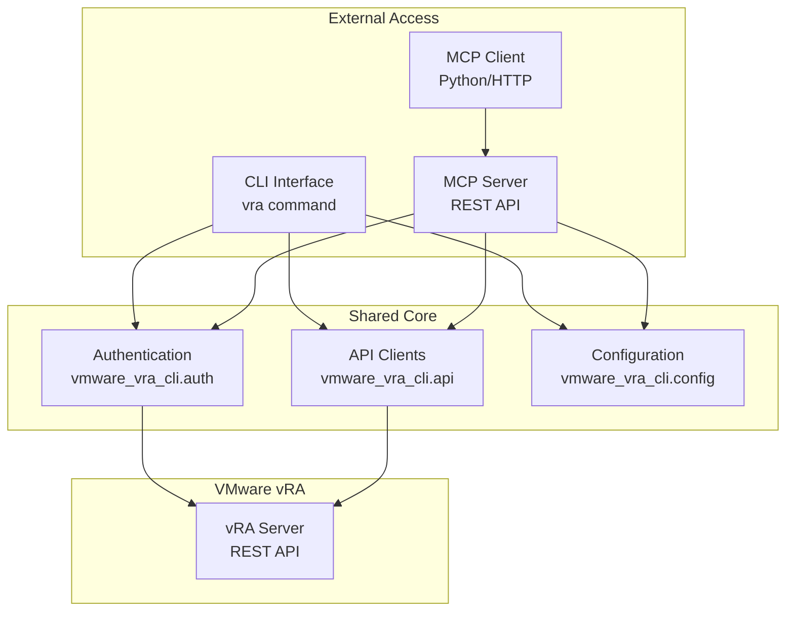

# MCP App & CLI Compatibility Matrix

This document provides a comprehensive compatibility matrix showing the usage relationships between the VMware vRA CLI and MCP Server components.

## Overview

The VMware vRA project provides two primary interfaces:
- **CLI**: Command-line interface (`vra`) for interactive terminal usage
- **MCP Server**: REST API server (`vra-server`) for programmatic access and web integrations

Both interfaces provide equivalent functionality through different access patterns, sharing the same underlying business logic and vRA API integration.

## Component Architecture



## Compatibility Matrix

### 🔐 Authentication & Security

| Feature | CLI | MCP Server | MCP Client | Compatibility | Notes |
|---------|-----|------------|------------|---------------|-------|
| Bearer Token Auth | ✅ | ✅ | ✅ | 100% | Shared `VRAAuthenticator` class |
| Keyring Storage | ✅ | ✅ | ✅ | 100% | Secure credential storage via system keyring |
| SSL/TLS Support | ✅ | ✅ | ✅ | 100% | Custom CA certificate support |
| Token Refresh | ✅ | ✅ | ✅ | 100% | Automatic refresh token handling |
| Multi-domain | ✅ | ✅ | ✅ | 100% | Identity source domain specification |
| Session Management | ✅ | ✅ | ✅ | 100% | Login/logout operations |

### ⚙️ Configuration Management

| Feature | CLI | MCP Server | MCP Client | Compatibility | Notes |
|---------|-----|------------|------------|---------------|-------|
| Environment Variables | ✅ | ✅ | ✅ | 100% | `VRA_*` prefix support |
| Config File | ✅ | ✅ | ✅ | 100% | Shared `config.py` module |
| Runtime Override | ✅ | ✅ | ✅ | 100% | Parameter-level configuration |
| Profile Support | ✅ | ✅ | ✅ | 100% | Multi-environment management |
| Validation | ✅ | ✅ | ✅ | 100% | Pydantic model validation |
| Dynamic Updates | ✅ | ✅ | ✅ | 100% | Real-time configuration changes |

### 📚 Service Catalog Operations

| Feature | CLI | MCP Server | MCP Client | Compatibility | Notes |
|---------|-----|------------|------------|---------------|-------|
| List Catalog Items | ✅ | ✅ | ✅ | 100% | Pagination, filtering, project scoping |
| Get Item Details | ✅ | ✅ | ✅ | 100% | Full metadata and properties |
| Request Schema | ✅ | ✅ | ✅ | 100% | JSON schema for input validation |
| Request Catalog Item | ✅ | ✅ | ✅ | 100% | Deployment creation with inputs |
| Schema Export | ✅ | ✅ | ✅ | 100% | Bulk schema export to files |
| Input Validation | ✅ | ✅ | ✅ | 100% | Pre-request validation |

### 🚀 Deployment Management

| Feature | CLI | MCP Server | MCP Client | Compatibility | Notes |
|---------|-----|------------|------------|---------------|-------|
| List Deployments | ✅ | ✅ | ✅ | 100% | Status filtering, pagination |
| Get Deployment | ✅ | ✅ | ✅ | 100% | Full deployment details |
| Delete Deployment | ✅ | ✅ | ✅ | 100% | Confirmation workflow |
| Resource Listing | ✅ | ✅ | ✅ | 100% | Deployment resource details |
| Bulk Export | ✅ | ✅ | ✅ | 100% | Export by catalog item grouping |
| Status Monitoring | ✅ | ✅ | ✅ | 100% | Real-time status updates |

### 🔖 Tag Management

| Feature | CLI | MCP Server | MCP Client | Compatibility | Notes |
|---------|-----|------------|------------|---------------|-------|
| List Tags | ✅ | ✅ | ✅ | 100% | Search and pagination support |
| Create Tag | ✅ | ✅ | ✅ | 100% | Key-value-description model |
| Update Tag | ✅ | ✅ | ✅ | 100% | Partial update support |
| Delete Tag | ✅ | ✅ | ✅ | 100% | Confirmation workflow |
| Assign to Resource | ✅ | ✅ | ✅ | 100% | Deployment and catalog item tagging |
| Remove from Resource | ✅ | ✅ | ✅ | 100% | Tag removal operations |
| List Resource Tags | ✅ | ✅ | ✅ | 100% | Resource tag enumeration |

### ⚡ Workflow Operations

| Feature | CLI | MCP Server | MCP Client | Compatibility | Notes |
|---------|-----|------------|------------|---------------|-------|
| List Workflows | ✅ | ✅ | ✅ | 100% | vRO workflow discovery |
| Execute Workflow | ✅ | ✅ | ✅ | 100% | Parameter passing and execution |
| Monitor Execution | ✅ | ✅ | ✅ | 100% | Execution state tracking |
| Input Parsing | ✅ | ✅ | ✅ | 100% | JSON/YAML input support |

### 📊 Reporting & Analytics

| Feature | CLI | MCP Server | MCP Client | Compatibility | Notes |
|---------|-----|------------|------------|---------------|-------|
| Activity Timeline | ✅ | ✅ | ✅ | 100% | Time-based deployment analysis |
| Catalog Usage | ✅ | ✅ | ✅ | 100% | Usage statistics and success rates |
| Unsync Report | ✅ | ✅ | ✅ | 100% | Unlinked deployment analysis |
| Export Capabilities | ✅ | ✅ | ✅ | 100% | JSON/YAML/Table output formats |

### 🎨 Output & Formatting

| Feature | CLI | MCP Server | MCP Client | Compatibility | Notes |
|---------|-----|------------|------------|---------------|-------|
| Table Format | ✅ | ❌ | ❌ | N/A | CLI-specific rich formatting |
| JSON Format | ✅ | ✅ | ✅ | 100% | Standard JSON responses |
| YAML Format | ✅ | ✅ | ✅ | 100% | Human-readable YAML |
| Rich Console | ✅ | ❌ | ❌ | N/A | CLI-specific terminal styling |
| Progress Indicators | ✅ | ❌ | ❌ | N/A | CLI-specific user experience |
| Error Formatting | ✅ | ✅ | ✅ | 100% | Structured error responses |

## Usage Patterns

### 1. Interactive Development
**Use Case**: Daily administration and exploration
**Recommended Interface**: CLI
```bash
vra auth login
vra catalog list --format table
vra deployment list --project dev
```

### 2. Automation Scripts
**Use Case**: CI/CD pipelines and scripting
**Recommended Interface**: CLI + JSON output
```bash
#!/bin/bash
deployments=$(vra deployment list --format json)
echo "$deployments" | jq '.[] | select(.status=="FAILED")'
```

### 3. Web Applications
**Use Case**: Custom dashboards and web tools
**Recommended Interface**: MCP Server + Client
```python
from examples.mcp_client_example import VRAMCPClient
client = VRAMCPClient("http://localhost:8000")
items = client.list_catalog_items()
```

### 4. External System Integration
**Use Case**: Integration with other tools and platforms
**Recommended Interface**: MCP Server REST API
```bash
curl -X GET "http://localhost:8000/catalog/items" \
  -H "accept: application/json"
```

## Deployment Scenarios

### 1. Local Development
- **CLI**: Direct installation via pipx/pip
- **MCP Server**: Local execution via `vra-server` command
- **Access**: Terminal and localhost:8000

### 2. Container-Based Development
- **CLI**: Docker container with mounted volumes
- **MCP Server**: Docker Compose orchestration
- **Access**: Container exec and exposed ports

### 3. Production Deployment
- **CLI**: Not recommended for production services
- **MCP Server**: Container orchestration (Kubernetes, Docker Swarm)
- **Access**: Load-balanced REST endpoints

### 4. Hybrid Environment
- **CLI**: Developer workstations and jump boxes
- **MCP Server**: Shared infrastructure for automation
- **Access**: Multiple access patterns based on use case

## Docker Compose Service Matrix

| Service | Purpose | Port | Profile | CLI Integration | MCP Integration |
|---------|---------|------|---------|-----------------|-----------------|
| `vra-server` | Main MCP Server | 8000 | default | ❌ | ✅ |
| `openapi-generator` | API Spec Generation | - | tools | ✅ | ✅ |
| `log-viewer` | Log Monitoring | 8080 | monitoring | ✅ | ✅ |

## Version Compatibility

| Component | Version Range | Python Support | Docker Support |
|-----------|---------------|----------------|----------------|
| CLI | 0.10.0+ | 3.10+ | ✅ |
| MCP Server | 0.10.0+ | 3.10+ | ✅ |
| MCP Client Example | 0.10.0+ | 3.10+ | ✅ |
| OpenAPI Schema | 3.0.3+ | N/A | ✅ |

## Migration Paths

### From CLI-Only to Hybrid
1. Install MCP Server components
2. Start `vra-server` alongside existing CLI usage
3. Gradually migrate automation to REST API calls
4. Maintain CLI for interactive operations

### From Custom Scripts to MCP Client
1. Replace direct vRA API calls with MCP Client
2. Leverage shared authentication and configuration
3. Benefit from unified error handling and retry logic
4. Maintain existing business logic

### From REST API to Full Integration
1. Deploy MCP Server in production environment
2. Implement proper load balancing and monitoring
3. Integrate with existing CI/CD pipelines
4. Provide CLI access for troubleshooting

## Troubleshooting Compatibility

### Common Issues

1. **Authentication Token Conflicts**
   - **Symptom**: Different tokens between CLI and MCP Server
   - **Solution**: Use shared configuration directory
   - **Prevention**: Consistent environment variable usage

2. **Configuration Drift**
   - **Symptom**: Different behavior between interfaces
   - **Solution**: Centralize configuration management
   - **Prevention**: Use Docker Compose for consistency

3. **Version Mismatches**
   - **Symptom**: Feature availability differences
   - **Solution**: Ensure component version alignment
   - **Prevention**: Coordinated deployment strategies

### Best Practices

1. **Unified Configuration**: Use environment variables for all interfaces
2. **Shared Volumes**: Mount consistent configuration directories
3. **Version Pinning**: Specify exact versions in deployment manifests
4. **Health Monitoring**: Implement comprehensive health checks
5. **Error Handling**: Consistent error response formats across interfaces

## Future Roadmap

### Planned Enhancements
- **GraphQL Interface**: Advanced query capabilities
- **WebSocket Support**: Real-time updates and streaming
- **Bulk Operations**: Enhanced batch processing
- **Plugin System**: Extensible functionality framework
- **Enhanced Security**: OAuth2/OIDC integration

### Compatibility Commitments
- **Backward Compatibility**: CLI commands remain stable
- **API Versioning**: MCP Server supports version negotiation
- **Migration Support**: Tools for seamless upgrades
- **Documentation**: Comprehensive compatibility guides

---

*This compatibility matrix is maintained alongside the project and updated with each release.*
