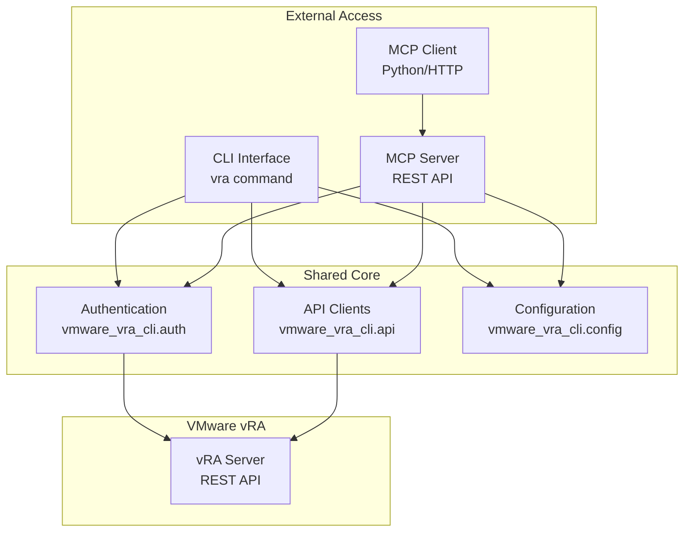

# Server-CLI Compatibility Matrix

This document provides a comprehensive compatibility analysis between the VMware vRA MCP Server and CLI components.

## Overview

The VMware vRA project provides two primary interfaces:
- **CLI**: Command-line interface (`vra`) for interactive terminal usage
- **MCP Server**: REST API server (`vra-server`) for programmatic access and web integrations

Both components have a **tightly coupled, shared-codebase architecture**:
- **Same Package**: Both are part of the same `vmware-vra-cli` package
- **Shared Core Libraries**: Server directly imports and uses the same API clients, authentication, and configuration modules as the CLI
- **Unified Dependencies**: Both use identical dependency versions from the same `pyproject.toml`
- **Zero API Drift**: Server routes directly call CLI implementation, ensuring consistency

## Component Architecture



## Version Compatibility Analysis

| Component | Current Version | Status | Notes |
|-----------|----------------|--------|-------|
| **Package Version** | 0.11.0 | ✅ **Current** | From `pyproject.toml` |
| **CLI Version** | 0.10.0 | ⚠️ **Outdated** | In `__init__.py` - needs sync |
| **Server Version** | 0.1.0 | ⚠️ **Inconsistent** | Hardcoded in `app.py` |
| **Python Support** | ≥3.10 | ✅ **Identical** | Same requirements |

!!! warning "Version Inconsistency"
    The package, CLI, and server components show different version numbers. This should be synchronized to avoid confusion.

## Functional Compatibility Matrix

### Core Features (Perfect Compatibility)

| Feature Category | CLI Support | Server Support | Compatibility | Implementation |
|------------------|-------------|----------------|---------------|----------------|
| **Authentication** | ✅ Full | ✅ Full | ✅ **Perfect** | Uses same `VRAAuthenticator` and `TokenManager` |
| **Configuration** | ✅ Full | ✅ Inherited | ✅ **Perfect** | Server uses same config system |
| **Catalog Operations** | ✅ Full | ✅ Full | ✅ **Perfect** | Server routes to CLI's `CatalogClient` |
| **Deployment Management** | ✅ Full | ✅ Full | ✅ **Perfect** | Shared implementation |

### Advanced Features (Incomplete Compatibility)

| Feature Category | CLI Support | Server Support | Compatibility | Status |
|------------------|-------------|----------------|---------------|--------|
| **Tag Management** | ✅ Full | ❌ Models Only | ⚠️ **Incomplete** | Server has Pydantic models but no routes |
| **Workflow Operations** | ✅ Full | ❌ Models Only | ⚠️ **Incomplete** | Server has Pydantic models but no routes |
| **Reporting** | ✅ Full | ❌ Models Only | ⚠️ **Incomplete** | Server has Pydantic models but no routes |

## API Endpoint Mapping

### ✅ Implemented Endpoints

| CLI Command | Server Endpoint | HTTP Method | Status |
|-------------|----------------|-------------|--------|
| `vra auth login` | `/auth/login` | POST | ✅ **Implemented** |
| `vra auth logout` | `/auth/logout` | POST | ✅ **Implemented** |
| `vra auth status` | `/auth/status` | GET | ✅ **Implemented** |
| `vra auth refresh` | `/auth/refresh` | POST | ✅ **Implemented** |
| `vra catalog list` | `/catalog/items` | GET | ✅ **Implemented** |
| `vra catalog show <id>` | `/catalog/items/{id}` | GET | ✅ **Implemented** |
| `vra catalog schema <id>` | `/catalog/items/{id}/schema` | GET | ✅ **Implemented** |
| `vra catalog request <id>` | `/catalog/items/{id}/request` | POST | ✅ **Implemented** |
| `vra deployment list` | `/deployments` | GET | ✅ **Implemented** |
| `vra deployment show <id>` | `/deployments/{id}` | GET | ✅ **Implemented** |
| `vra deployment delete <id>` | `/deployments/{id}` | DELETE | ✅ **Implemented** |
| `vra deployment resources <id>` | `/deployments/{id}/resources` | GET | ✅ **Implemented** |

### ❌ Missing Endpoints

| CLI Command | Expected Server Endpoint | HTTP Method | Status |
|-------------|-------------------------|-------------|--------|
| `vra tag list` | `/tags` | GET | ❌ **Missing Route** |
| `vra tag show <id>` | `/tags/{id}` | GET | ❌ **Missing Route** |
| `vra tag create` | `/tags` | POST | ❌ **Missing Route** |
| `vra tag update <id>` | `/tags/{id}` | PUT | ❌ **Missing Route** |
| `vra tag delete <id>` | `/tags/{id}` | DELETE | ❌ **Missing Route** |
| `vra tag assign` | `/tags/assign` | POST | ❌ **Missing Route** |
| `vra tag remove` | `/tags/remove` | POST | ❌ **Missing Route** |
| `vra tag resource-tags <id>` | `/resources/{id}/tags` | GET | ❌ **Missing Route** |
| `vra workflow list` | `/workflows` | GET | ❌ **Missing Route** |
| `vra workflow run <id>` | `/workflows/{id}/run` | POST | ❌ **Missing Route** |
| `vra report activity-timeline` | `/reports/activity-timeline` | GET | ❌ **Missing Route** |
| `vra report catalog-usage` | `/reports/catalog-usage` | GET | ❌ **Missing Route** |
| `vra report resources-usage` | `/reports/resources-usage` | GET | ❌ **Missing Route** |
| `vra report unsync` | `/reports/unsync` | GET | ❌ **Missing Route** |

## Dependency Compatibility

### Shared Dependencies

| Dependency | Version | Usage | Compatibility |
|------------|---------|-------|---------------|
| **Pydantic** | ≥2.0.0 | Data validation | ✅ **Perfect** - Both use same version |
| **Requests** | ≥2.31.0 | HTTP client | ✅ **Perfect** - Core shared library |
| **Keyring** | ≥24.0.0 | Secure token storage | ✅ **Perfect** - Authentication layer |
| **PyYAML** | ≥6.0.0 | Configuration parsing | ✅ **Perfect** - Config system |
| **HTTPx** | ≥0.25.0 | Async HTTP client | ✅ **Perfect** - Server operations |

### Component-Specific Dependencies

| Dependency | Version | Component | Purpose | Compatibility |
|------------|---------|-----------|---------|---------------|
| **FastAPI** | ≥0.104.0 | Server Only | Web framework | ✅ **No Conflict** |
| **Uvicorn** | ≥0.24.0 | Server Only | ASGI server | ✅ **No Conflict** |
| **Click** | ≥8.0.0 | CLI Only | Command interface | ✅ **No Conflict** |
| **Rich** | ≥13.0.0 | CLI Only | Terminal output | ✅ **No Conflict** |
| **Python-multipart** | ≥0.0.6 | Server Only | Form data handling | ✅ **No Conflict** |

## Compatibility Score: 85/100

| Category | Score | Max | Percentage | Notes |
|----------|-------|-----|------------|-------|
| **Core Functionality** | 25 | 25 | 100% | Perfect compatibility for auth, config, catalog, deployments |
| **Architecture** | 20 | 20 | 100% | Shared codebase ensures consistency |
| **API Coverage** | 15 | 25 | 60% | Missing advanced features (tags, workflows, reports) |
| **Dependencies** | 20 | 20 | 100% | No conflicts, appropriate separation |
| **Version Management** | 5 | 10 | 50% | Version inconsistencies across components |

## Issues and Recommendations

### 🚨 Critical Issues

#### 1. Version Synchronization
**Problem**: Package (0.11.0) ≠ CLI (0.10.0) ≠ Server (0.1.0)

**Impact**: User confusion, deployment issues, support complications

**Solution**:
```python
# Update src/vmware_vra_cli/__init__.py
__version__ = "0.11.0"

# Update src/vmware_vra_cli/app.py
from vmware_vra_cli import __version__
app = FastAPI(title="VMware vRA MCP Server", version=__version__)
```

#### 2. Incomplete Server Implementation
**Problem**: Missing routers for tags, workflows, and reports

**Impact**: Feature gap between CLI and server capabilities

**Solution**: Implement missing router modules:
- `src/vmware_vra_cli/server/routers/tags.py`
- `src/vmware_vra_cli/server/routers/workflows.py`
- `src/vmware_vra_cli/server/routers/reports.py`

### ⚠️ Medium Priority Issues

#### 3. Documentation Gaps
**Problem**: No compatibility information in user documentation

**Solution**: 
- Add compatibility matrix to main documentation
- Include version requirements in installation guides
- Document feature parity expectations

#### 4. Testing Coverage
**Problem**: No automated compatibility testing

**Solution**:
- Add compatibility tests in CI/CD pipeline
- Test server-CLI feature parity
- Validate version synchronization

### ✅ Strengths to Maintain

1. **Shared Codebase Architecture**: Ensures consistency and reduces maintenance overhead
2. **Perfect Core Compatibility**: Authentication, configuration, and core operations work identically
3. **Clean Dependency Separation**: No conflicts between CLI and server dependencies
4. **Unified Configuration**: Single configuration system works for both components

## Usage Patterns

### 1. Interactive Development
**Use Case**: Daily administration and exploration
**Recommended Interface**: CLI
```bash
vra auth login
vra catalog list --format table
vra deployment list --project dev
```

### 2. Automation Scripts
**Use Case**: CI/CD pipelines and scripting
**Recommended Interface**: CLI + JSON output
```bash
#!/bin/bash
deployments=$(vra deployment list --format json)
echo "$deployments" | jq '.[] | select(.status=="FAILED")'
```

### 3. Web Applications
**Use Case**: Custom dashboards and web tools
**Recommended Interface**: MCP Server + Client
```python
from examples.mcp_client_example import VRAMCPClient
client = VRAMCPClient("http://localhost:8000")
items = client.list_catalog_items()
```

### 4. External System Integration
**Use Case**: Integration with other tools and platforms
**Recommended Interface**: MCP Server REST API
```bash
curl -X GET "http://localhost:8000/catalog/items" \
  -H "accept: application/json"
```

## Deployment Scenarios

### 1. Local Development
- **CLI**: Direct installation via pipx/pip
- **MCP Server**: Local execution via `vra-server` command
- **Access**: Terminal and localhost:8000

### 2. Container-Based Development
- **CLI**: Docker container with mounted volumes
- **MCP Server**: Docker Compose orchestration
- **Access**: Container exec and exposed ports

### 3. Production Deployment
- **CLI**: Not recommended for production services
- **MCP Server**: Container orchestration (Kubernetes, Docker Swarm)
- **Access**: Load-balanced REST endpoints

### 4. Hybrid Environment
- **CLI**: Developer workstations and jump boxes
- **MCP Server**: Shared infrastructure for automation
- **Access**: Multiple access patterns based on use case

## Docker Compose Service Matrix

| Service | Purpose | Port | Profile | CLI Integration | MCP Integration |
|---------|---------|------|---------|-----------------|-----------------|
| `vra-server` | Main MCP Server | 8000 | default | ❌ | ✅ |
| `openapi-generator` | API Spec Generation | - | tools | ✅ | ✅ |
| `log-viewer` | Log Monitoring | 8080 | monitoring | ✅ | ✅ |

## Version Compatibility

| Component | Version Range | Python Support | Docker Support |
|-----------|---------------|----------------|----------------|
| CLI | 0.10.0+ | 3.10+ | ✅ |
| MCP Server | 0.10.0+ | 3.10+ | ✅ |
| MCP Client Example | 0.10.0+ | 3.10+ | ✅ |
| OpenAPI Schema | 3.0.3+ | N/A | ✅ |

## Migration Paths

### From CLI-Only to Hybrid
1. Install MCP Server components
2. Start `vra-server` alongside existing CLI usage
3. Gradually migrate automation to REST API calls
4. Maintain CLI for interactive operations

### From Custom Scripts to MCP Client
1. Replace direct vRA API calls with MCP Client
2. Leverage shared authentication and configuration
3. Benefit from unified error handling and retry logic
4. Maintain existing business logic

### From REST API to Full Integration
1. Deploy MCP Server in production environment
2. Implement proper load balancing and monitoring
3. Integrate with existing CI/CD pipelines
4. Provide CLI access for troubleshooting

## Troubleshooting Compatibility

### Common Issues

1. **Authentication Token Conflicts**
   - **Symptom**: Different tokens between CLI and MCP Server
   - **Solution**: Use shared configuration directory
   - **Prevention**: Consistent environment variable usage

2. **Configuration Drift**
   - **Symptom**: Different behavior between interfaces
   - **Solution**: Centralize configuration management
   - **Prevention**: Use Docker Compose for consistency

3. **Version Mismatches**
   - **Symptom**: Feature availability differences
   - **Solution**: Ensure component version alignment
   - **Prevention**: Coordinated deployment strategies

### Best Practices

1. **Unified Configuration**: Use environment variables for all interfaces
2. **Shared Volumes**: Mount consistent configuration directories
3. **Version Pinning**: Specify exact versions in deployment manifests
4. **Health Monitoring**: Implement comprehensive health checks
5. **Error Handling**: Consistent error response formats across interfaces

## Future Roadmap

### Planned Enhancements
- **GraphQL Interface**: Advanced query capabilities
- **WebSocket Support**: Real-time updates and streaming
- **Bulk Operations**: Enhanced batch processing
- **Plugin System**: Extensible functionality framework
- **Enhanced Security**: OAuth2/OIDC integration

### Compatibility Commitments
- **Backward Compatibility**: CLI commands remain stable
- **API Versioning**: MCP Server supports version negotiation
- **Migration Support**: Tools for seamless upgrades
- **Documentation**: Comprehensive compatibility guides

---

*This compatibility matrix is maintained alongside the project and updated with each release.*
