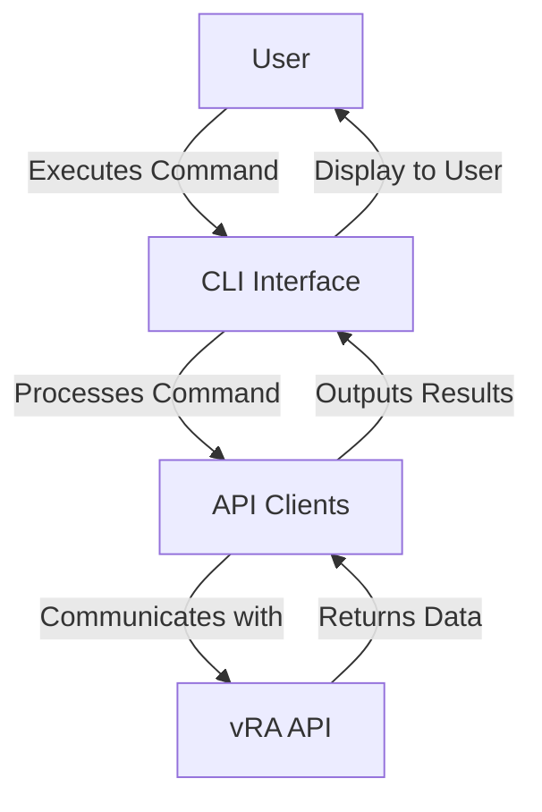

# Architecture Guide

This document provides an in-depth overview of the VMware vRA CLI project architecture, explaining the key components and how they interact within the system.

## Overview

The VMware vRA CLI project is designed to facilitate seamless interaction with VMware vRealize Automation through a command-line interface, providing a set of tools for developers and administrators.

- **CLI**: Implements the command-line interface using Click, a Python package for creating command-line commands.
- **API Clients**: Handles communication with the vRA API endpoints, structured around service-focused components.
- **Configuration Management**: Manages application configuration via environment variables and configuration files.
- **Credential Management**: Provides secure storage of API credentials using system keyring.

## Component Breakdown

### 1. Command-Line Interface (CLI)
The CLI is powered by [Click](https://click.palletsprojects.com/), offering clear syntax, automatic generation of help documentation, and rich user interaction features.

- **Structure**: Organized with a main entry point (`cli.py`) and sub-commands for different functionalities.

#### Key Features:
- **Group Commands**: Commands are grouped under meaningful categories (e.g. `auth`, `catalog`, `deployment`, `tag`).
- **Options and Arguments**: Users can pass inputs using flags, providing flexibility and control over operations.
- **Help and Guidance**: Built-in options for `--help` provide easy access to usage information.

### 2. API Clients
API clients form the backbone of the CLI, allowing it to interact with various endpoints exposed by vRA.

- **HTTP Requests**: Built on top of the Python `requests` library for HTTP communication.
- **Error Handling**: Implements robust error handling mechanisms for dealing with API errors.

#### Key Features:
- **Session Management**: Utilizes persistent sessions for efficient API calls.
- **Resource Models**: Leverages Pydantic models for structured data management.
- **Automated Retries**: Includes automatic retry logic for transient network issues.

### 3. Configuration Management
- **Environment Variables**: Supports reading configuration from environment variables to allow for dynamic parameterization.
- **Configuration Files**: Uses local configuration files (e.g. `config.yaml`) for persistent settings.
- **Defaults and Overrides**: Allows default values with the option to override configurations.

### 4. Credential Management
- **Keyring Integration**: Utilizes the `keyring` library for storing and retrieving sensitive data securely.
- **Automated Token Management**: Manages authentication tokens, removing the need for manual input.

## Interaction Flow
The following diagram illustrates the flow of interaction within the CLI:



### API Endpoint Interaction
- **Authentication**: Initial login to obtain a session token for API communication.
- **Service Catalog**: Access and manage catalog items such as listing, requesting, and obtaining schemas.
- **Deployments**: Handle deployment-related functionalities including creation, deletion, and listing.
- **Tags**: Comprehensive management of resource tags to provide organization and categorization.

## Best Practices

### Code Quality
- **Adhere to PEP 8**: Follow Python's style guide for consistency.
- **Module Isolation**: Keep modules focused on specific functionality to ensure maintainability.
- **Test Coverage**: Develop unit and integration tests to validate functionality.

### Security
- **Secure Storage**: Always store credentials securely in the system keyring.
- **TLS/SSL Verification**: Ensure all API calls verify server certificates by default.

### Documentation
- **User and Developer Docs**: Maintain comprehensive documentation for both end-users and developers.
- **Auto-Generated Help**: Leverage Click's automation for generating command help messages.

### Performance
- **Connection Reuse**: Utilize persistent HTTP sessions for efficiency.
- **Caching Strategy**: Implement caching for frequent, read-only operations where applicable.

## Future Enhancements

- **Cloud Events Integration**: Explore integration with cloud events for real-time notifications.
- **Additional Services**: Extend support for more vRA services as APIs evolve.
- **Scalability Improvements**: Optimize for larger deployments with distributed caching solutions.

---

This architecture guide serves as a framework to understand and extend the VMware vRA CLI project. For more detailed guidelines, refer to our [Contributing Guide](contributing.md) and the extensive code comments across the repository.

---

*Built with efficiency and modern development standards to streamline VMware vRA interactions.*

``` 

# Happy Coding! 🎉 

```
