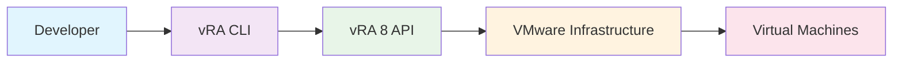
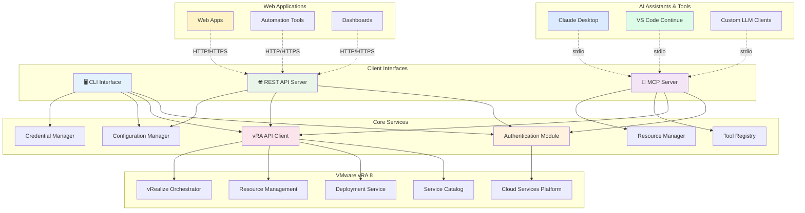

# VMware vRA CLI & MCP Server

[](https://pypi.org/project/vmware-vra-cli/)
[](https://pypi.org/project/vmware-vra-cli/)
[](https://github.com/brunseba/tools-vmware-vra-cli/blob/main/LICENSE)
[](https://github.com/brunseba/tools-vmware-vra-cli/actions)
[](https://modelcontextprotocol.io/)

A comprehensive Python toolkit for VMware vRealize Automation 8 automation, featuring a powerful CLI, a fully compliant **Model Context Protocol (MCP) server** for LLM integration, and a traditional REST API server. This toolkit enables developers, system administrators, and AI assistants to automate VM provisioning, management, and infrastructure operations through multiple interfaces.

## Features

!!! success "Multi-Interface Architecture"
    ### 🖥️ **Command Line Interface (CLI)**
    - **Authentication Management**: Secure authentication with vRA 8 using bearer tokens
    - **Service Catalog Management**: Access and request catalog items programmatically
    - **Deployment Lifecycle**: Create, manage, and destroy deployments through the CLI
    - **Deployment Export**: Export all deployments grouped by catalog item for backup, migration, and analytics
    - **Tag Management**: Comprehensive tagging system for resource organization and governance
    - **Workflow Operations**: Execute and monitor vRealize Orchestrator workflows
    - **Analytics & Reporting**: Generate usage reports, activity timelines, resources usage analysis, and unsynced deployment analysis
    - **Resource Usage Monitoring**: Consolidated view of all resources across deployments with detailed breakdown by type and status
    - **Configuration Management**: Flexible configuration options with environment variables and config files
    - **Rich Output**: Beautiful terminal output with colors and progress indicators
    - **Secure Credential Storage**: Integration with system keyring for secure credential management
    - **Batch Operations**: Support for bulk operations for high-volume use cases
    
    ### 🤖 **Model Context Protocol (MCP) Server**
    - **Full MCP 2025-06-28 Compliance**: JSON-RPC 2.0 protocol implementation with stdio transport
    - **AI Assistant Integration**: Native support for Claude Desktop, VS Code Continue, and custom LLM clients
    - **Dynamic Resource Discovery**: Real-time vRA resource enumeration and metadata retrieval
    - **Comprehensive Tool Suite**: 26+ specialized tools for VM provisioning, deployment management, analytics, and workflow automation
    - **Secure Authentication**: Token-based authentication with automatic refresh and secure credential handling
    - **Smart Resource Context**: Intelligent resource filtering and contextual information for AI decision-making
    - **Production Ready**: Comprehensive error handling, logging, and monitoring capabilities
    
    ### 🌐 **REST API Server** 
    - **HTTP/HTTPS Support**: Traditional REST API endpoints for web application integration
    - **OpenAPI Documentation**: Auto-generated API documentation with Swagger UI
    - **Multiple Authentication Methods**: API keys, OAuth2, and token-based authentication
    - **Rate Limiting & Security**: Built-in protection against abuse and unauthorized access
    - **Webhook Support**: Event-driven integrations for real-time notifications

## Why VMware vRA CLI?

This tool was inspired by real-world use cases where development teams need to create and destroy 1000+ virtual machines per day. Instead of clicking through the vRA 8 self-service portal repeatedly, developers can now automate these tasks through a simple CLI interface.



## Quick Examples

### 🖥️ **CLI Interface**
```bash
# Authenticate with vRA
vra auth login --username admin --url https://vra.company.com

# List available catalog items
vra catalog list

# Request a catalog item
vra catalog request <catalog-item-id> --project <project-id> --name "dev-vm-001"

# List deployments
vra deployment list

# Generate comprehensive reports
vra report activity-timeline --days-back 90 --group-by week
vra report catalog-usage --detailed-resources --sort-by deployments
vra report resources-usage --group-by resource-type
vra report unsync --show-details

# Create and assign tags
vra tag create "environment" --value "development" --description "Dev environment"
vra tag assign <deployment-id> <tag-id>

# Clean up
vra deployment delete <deployment-id>
```

### 🤖 **AI Assistant (via MCP Server)**  
```
User: "Can you provision a new development VM for our web app project?"

Claude: I'll help you provision a development VM. Let me first check what 
catalog items are available and then create the deployment.

*[Uses list_catalog_items tool]*
*[Uses request_catalog_item tool with appropriate parameters]*

I've successfully provisioned a new VM named "webapp-dev-001" in your 
development project. The deployment is currently in progress and should 
be ready in about 5 minutes. Would you like me to monitor the deployment 
status or help you configure anything else?
```

### 🌐 **REST API Integration**
```python
import requests

# Authenticate and get deployments via REST API
response = requests.get(
    "https://your-vra-api.company.com/api/v1/deployments",
    headers={"Authorization": "Bearer <your-api-token>"}
)
deployments = response.json()

# Create a new deployment
deployment_data = {
    "name": "api-vm-001",
    "project_id": "<project-id>",
    "catalog_item_id": "<catalog-item-id>"
}
response = requests.post(
    "https://your-vra-api.company.com/api/v1/deployments",
    json=deployment_data,
    headers={"Authorization": "Bearer <your-api-token>"}
)
```

## Use Cases

### 💻 **Development Teams**
- **Rapid Environment Provisioning**: Spin up development environments in seconds via CLI or AI assistant
- **Automated Testing Infrastructure**: Create and destroy test environments as part of CI/CD pipelines
- **Smart Resource Management**: Use AI assistants to intelligently manage resource allocation and cleanup
- **Integration Testing**: Provision complex multi-VM environments for integration testing

### 🔧 **System Administrators**
- **Bulk Operations**: Manage hundreds of VMs with batch operations through CLI
- **Infrastructure Automation**: Automate routine provisioning and maintenance tasks
- **Resource Monitoring**: Generate comprehensive reports on resource usage and optimization
- **Compliance Management**: Enforce tagging policies and governance through automated workflows

### ⚙️ **DevOps Engineers**
- **Infrastructure as Code**: Integrate with GitOps workflows for infrastructure management
- **Pipeline Integration**: Embed VM provisioning in automated deployment pipelines
- **Environment Standardization**: Ensure consistent environments across development, staging, and production
- **Cost Optimization**: Use analytics to identify and eliminate resource waste

### 🤖 **AI-Powered Workflows**
- **Intelligent Provisioning**: AI assistants can analyze requirements and suggest optimal VM configurations
- **Natural Language Operations**: Request complex infrastructure changes using natural language
- **Automated Troubleshooting**: AI assistants can diagnose and resolve common deployment issues
- **Smart Reporting**: Generate insights and recommendations from infrastructure data
- **Context-Aware Management**: AI understands project context and suggests relevant actions

### 🌐 **Web Application Developers**
- **REST API Integration**: Embed vRA functionality directly into web applications and dashboards
- **Custom Portals**: Build self-service portals with enhanced user experiences
- **Webhook Automation**: Create event-driven workflows for real-time infrastructure management
- **Multi-tenant Solutions**: Provide isolated environments for different teams or customers

## Architecture Overview



## Getting Started

Choose your preferred interface and get up and running in minutes:

### 🖥️ **Command Line Interface**
1. **[Installation](getting-started/installation.md)** - Install the CLI tool
2. **[Quick Start](getting-started/quick-start.md)** - Your first VM in 5 minutes
3. **[Configuration](getting-started/configuration.md)** - Configure for your environment
4. **[CLI Reference](cli-reference.md)** - Complete command reference

### 🤖 **MCP Server for AI Assistants**
1. **[MCP Server Setup](mcp-server/setup.md)** - Install and configure the MCP server
2. **[Claude Desktop Integration](mcp-server/integrations/claude-desktop.md)** - Connect with Claude Desktop
3. **[VS Code Continue Integration](mcp-server/integrations/vscode-continue.md)** - Integrate with VS Code Continue
4. **[Custom Client Development](mcp-server/integrations/custom-clients.md)** - Build custom LLM integrations
5. **[MCP Tools Reference](mcp-server/tools-reference.md)** - Complete MCP tools documentation

### 🌐 **REST API Server**
1. **[REST API Setup](rest-api/setup.md)** - Deploy the REST API server
2. **[API Documentation](rest-api/openapi.md)** - Interactive OpenAPI documentation
3. **[Authentication](rest-api/authentication.md)** - Configure API authentication
4. **[Integration Examples](rest-api/examples.md)** - Web application integration examples

### 📊 **Comparison & Migration**
- **[Feature Comparison](compatibility-matrix.md)** - CLI vs MCP vs REST API capabilities
- **[Migration Guide](migration-guide.md)** - Migrate between interfaces

## Support

- **Documentation**: Comprehensive guides and API reference
- **Issues**: Report bugs on [GitHub Issues](https://github.com/brunseba/tools-vmware-vra-cli/issues)
- **Contributing**: See our [Contributing Guide](developer-guide/contributing.md)

---

*Built with ❤️ for VMware administrators and developers*
