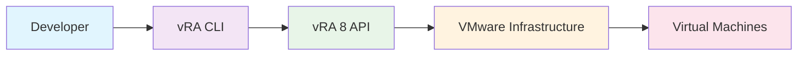
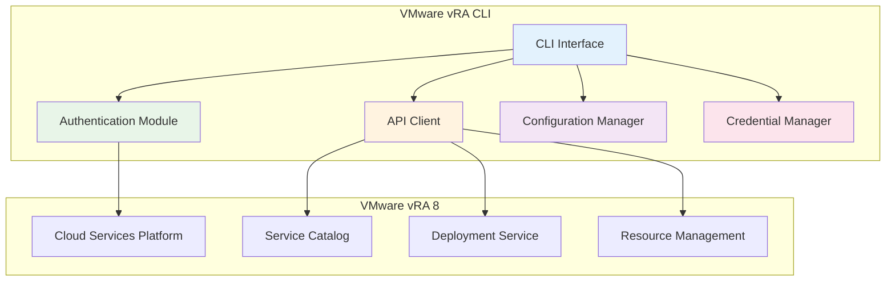

# VMware vRA CLI

[](https://pypi.org/project/vmware-vra-cli/)
[](https://pypi.org/project/vmware-vra-cli/)
[](https://github.com/brun_s/vmware-vra-cli/blob/main/LICENSE)
[](https://github.com/brun_s/vmware-vra-cli/actions)

A powerful Python CLI tool to interact with VMware vRealize Automation 8 via REST API. This tool enables developers and system administrators to automate VM provisioning, management, and decommissioning tasks through a simple command-line interface.

## Features

!!! success "Key Capabilities"
    - **Authentication Management**: Secure authentication with vRA 8 using bearer tokens
    - **Service Catalog Management**: Access and request catalog items programmatically
    - **Deployment Lifecycle**: Create, manage, and destroy deployments through the CLI
    - **Deployment Export**: Export all deployments grouped by catalog item for backup, migration, and analytics
    - **Tag Management**: Comprehensive tagging system for resource organization and governance
    - **Workflow Operations**: Execute and monitor vRealize Orchestrator workflows
    - **Analytics & Reporting**: Generate usage reports, activity timelines, and unsynced deployment analysis
    - **Configuration Management**: Flexible configuration options with environment variables and config files
    - **Rich Output**: Beautiful terminal output with colors and progress indicators
    - **Secure Credential Storage**: Integration with system keyring for secure credential management
    - **Batch Operations**: Support for bulk operations for high-volume use cases

## Why VMware vRA CLI?

This tool was inspired by real-world use cases where development teams need to create and destroy 1000+ virtual machines per day. Instead of clicking through the vRA 8 self-service portal repeatedly, developers can now automate these tasks through a simple CLI interface.



## Quick Example

```bash
# Authenticate with vRA
vra auth login --username admin --url https://vra.company.com

# List available catalog items
vra catalog list

# Request a catalog item
vra catalog request <catalog-item-id> --project <project-id> --name "dev-vm-001"

# List deployments
vra deployment list

# Create and assign tags
vra tag create "environment" --value "development" --description "Dev environment"
vra tag assign <deployment-id> <tag-id>

# Clean up
vra deployment delete <deployment-id>
```

## Use Cases

### Development Teams
- Rapid provisioning of development environments
- Automated testing infrastructure setup
- CI/CD pipeline integration

### System Administrators
- Bulk VM operations
- Infrastructure automation
- Resource management and monitoring

### DevOps Engineers
- Infrastructure as Code implementation
- Automated deployment pipelines
- Environment standardization

## Architecture Overview



## Getting Started

Get up and running in minutes:

1. **[Installation](getting-started/installation.md)** - Install the CLI tool
2. **[Quick Start](getting-started/quick-start.md)** - Your first VM in 5 minutes
3. **[Configuration](getting-started/configuration.md)** - Configure for your environment
4. **[MCP Server Guide](mcp-server.md)** - REST API server for web integrations
5. **[Compatibility Matrix](compatibility-matrix.md)** - CLI and MCP Server feature comparison

## Support

- **Documentation**: Comprehensive guides and API reference
- **Issues**: Report bugs on [GitHub Issues](https://github.com/brun_s/vmware-vra-cli/issues)
- **Contributing**: See our [Contributing Guide](developer-guide/contributing.md)

---

*Built with ❤️ for VMware administrators and developers*
