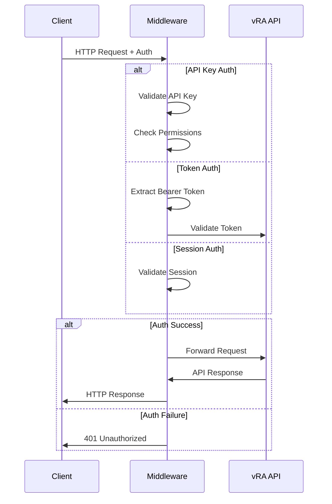

# REST API Authentication

This guide covers authentication methods and configuration for the VMware vRA REST API server.

## Authentication Overview

The REST API server supports multiple authentication methods:

1. **Token-based Authentication** (Primary)
2. **API Key Authentication** (Optional)
3. **Session-based Authentication** (Web apps)

## Token-based Authentication

### 1. Pre-authenticate via CLI

Use the CLI to authenticate first, then start the server:

```bash
# Authenticate with vRA
vra auth login --username admin --url https://vra.company.com

# Start REST server (inherits authentication)
vra-rest-server
```

### 2. Environment Variables

Set credentials via environment variables:

```bash
export VRA_USERNAME="admin@corp.local"
export VRA_PASSWORD="your-password"
export VRA_URL="https://vra.company.com"
export VRA_TENANT="corp.local"

# Start server
vra-rest-server
```

### 3. Runtime Authentication

Use the `/auth/login` endpoint after starting the server:

```bash
curl -X POST http://localhost:8000/auth/login \
  -H "Content-Type: application/json" \
  -d '{
    "username": "admin@corp.local",
    "password": "your-password",
    "url": "https://vra.company.com",
    "tenant": "corp.local"
  }'
```

Response:
```json
{
  "success": true,
  "message": "Authentication successful",
  "token_stored": true,
  "expires_at": "2024-01-15T16:30:00Z"
}
```

## API Key Authentication

### Configuration

Enable API key authentication in your configuration:

```json
{
  "rest_server": {
    "api_keys": {
      "enabled": true,
      "require_vra_auth": true,
      "keys": {
        "prod-api-key": {
          "permissions": ["read", "write", "admin"],
          "description": "Production API access",
          "expires_at": "2024-12-31T23:59:59Z"
        },
        "readonly-key": {
          "permissions": ["read"],
          "description": "Read-only access",
          "expires_at": null
        },
        "monitoring-key": {
          "permissions": ["read", "metrics"],
          "description": "Monitoring and metrics access",
          "expires_at": null
        }
      }
    }
  }
}
```

### Environment Variables

```bash
export VRA_REST_API_KEYS="prod-key:read-write,readonly-key:read,monitor-key:metrics"
```

### Usage

Include API key in requests:

```bash
# Using X-API-Key header
curl -H "X-API-Key: prod-api-key" http://localhost:8000/catalog/items

# Using Authorization header
curl -H "Authorization: Api-Key prod-api-key" http://localhost:8000/catalog/items
```

### API Key Management

#### Create API Key

```bash
curl -X POST http://localhost:8000/admin/api-keys \
  -H "Content-Type: application/json" \
  -H "Authorization: Bearer admin-token" \
  -d '{
    "name": "new-api-key",
    "permissions": ["read", "write"],
    "description": "New integration key",
    "expires_days": 365
  }'
```

#### List API Keys

```bash
curl -H "Authorization: Bearer admin-token" \
  http://localhost:8000/admin/api-keys
```

#### Revoke API Key

```bash
curl -X DELETE http://localhost:8000/admin/api-keys/key-name \
  -H "Authorization: Bearer admin-token"
```

## Session-based Authentication

For web applications, use session-based authentication:

### Configuration

```json
{
  "rest_server": {
    "sessions": {
      "enabled": true,
      "secret_key": "your-secret-key",
      "session_timeout": 3600,
      "secure_cookies": true,
      "same_site": "strict"
    }
  }
}
```

### Login Flow

```javascript
// Login request
const loginResponse = await fetch('/auth/login', {
  method: 'POST',
  headers: {
    'Content-Type': 'application/json',
  },
  credentials: 'include', // Include cookies
  body: JSON.stringify({
    username: 'admin@corp.local',
    password: 'password',
    url: 'https://vra.company.com'
  })
});

// Subsequent requests automatically include session cookie
const catalogResponse = await fetch('/catalog/items', {
  credentials: 'include'
});
```

## Authentication Middleware

### Request Flow



### Custom Authentication

Implement custom authentication handlers:

```python
from fastapi import HTTPException, status
from fastapi.security import HTTPBearer, HTTPAuthorizationCredentials

class CustomAuthHandler:
    def __init__(self):
        self.bearer_scheme = HTTPBearer(auto_error=False)
    
    async def authenticate(self, credentials: HTTPAuthorizationCredentials):
        if not credentials:
            raise HTTPException(
                status_code=status.HTTP_401_UNAUTHORIZED,
                detail="Authentication required"
            )
        
        # Custom validation logic
        if not self.validate_token(credentials.credentials):
            raise HTTPException(
                status_code=status.HTTP_401_UNAUTHORIZED,
                detail="Invalid authentication token"
            )
        
        return {"user": "authenticated_user"}
    
    def validate_token(self, token: str) -> bool:
        # Custom token validation
        return token in self.valid_tokens
```

## Security Configuration

### HTTPS/TLS

Always use HTTPS in production:

```bash
# Generate certificates
openssl req -x509 -newkey rsa:4096 -keyout key.pem -out cert.pem -days 365 -nodes

# Start server with SSL
vra-rest-server \
  --ssl-cert cert.pem \
  --ssl-key key.pem \
  --port 443
```

### CORS Configuration

Configure CORS for web applications:

```json
{
  "rest_server": {
    "cors": {
      "enabled": true,
      "allow_origins": ["https://app.company.com"],
      "allow_methods": ["GET", "POST", "PUT", "DELETE"],
      "allow_headers": ["Authorization", "Content-Type", "X-API-Key"],
      "allow_credentials": true,
      "max_age": 86400
    }
  }
}
```

### Rate Limiting

Implement rate limiting per authentication method:

```json
{
  "rest_server": {
    "rate_limiting": {
      "enabled": true,
      "default_limit": "100/minute",
      "per_auth_method": {
        "api_key": "500/minute",
        "token": "200/minute",
        "session": "150/minute"
      },
      "burst_size": 20,
      "storage": "memory"
    }
  }
}
```

## Authentication Endpoints

### POST /auth/login

Authenticate and create session/token.

**Request:**
```json
{
  "username": "admin@corp.local",
  "password": "password",
  "url": "https://vra.company.com",
  "tenant": "corp.local",
  "domain": "vsphere.local"
}
```

**Response:**
```json
{
  "success": true,
  "message": "Authentication successful",
  "token_stored": true,
  "expires_at": "2024-01-15T16:30:00Z",
  "user_info": {
    "username": "admin@corp.local",
    "roles": ["admin"],
    "tenant": "corp.local"
  }
}
```

### GET /auth/status

Check current authentication status.

**Response:**
```json
{
  "authenticated": true,
  "method": "token",
  "username": "admin@corp.local",
  "expires_at": "2024-01-15T16:30:00Z",
  "permissions": ["read", "write", "admin"]
}
```

### POST /auth/logout

Clear authentication session/token.

**Response:**
```json
{
  "success": true,
  "message": "Successfully logged out"
}
```

### POST /auth/refresh

Refresh authentication token.

**Response:**
```json
{
  "success": true,
  "message": "Token refreshed successfully",
  "expires_at": "2024-01-15T18:30:00Z"
}
```

## Error Handling

### Authentication Errors

| Status Code | Error | Description |
|-------------|-------|-------------|
| 401 | `AUTH_REQUIRED` | No authentication provided |
| 401 | `AUTH_INVALID` | Invalid credentials or token |
| 401 | `AUTH_EXPIRED` | Token or session expired |
| 403 | `AUTH_INSUFFICIENT` | Valid auth but insufficient permissions |
| 429 | `AUTH_RATE_LIMITED` | Too many authentication attempts |

### Error Response Format

```json
{
  "success": false,
  "error": "AUTH_INVALID",
  "message": "Invalid authentication token",
  "details": {
    "error_type": "TokenExpired",
    "expires_at": "2024-01-15T14:30:00Z",
    "suggestion": "Please refresh your token or re-authenticate"
  },
  "timestamp": "2024-01-15T15:00:00Z"
}
```

## Testing Authentication

### Unit Tests

```python
import pytest
from fastapi.testclient import TestClient
from app import app

client = TestClient(app)

def test_login_success():
    response = client.post("/auth/login", json={
        "username": "test@company.com",
        "password": "password",
        "url": "https://vra-test.company.com"
    })
    assert response.status_code == 200
    assert response.json()["success"] is True

def test_api_key_auth():
    response = client.get("/catalog/items", 
                         headers={"X-API-Key": "test-key"})
    assert response.status_code == 200

def test_invalid_auth():
    response = client.get("/catalog/items",
                         headers={"Authorization": "Bearer invalid-token"})
    assert response.status_code == 401
```

### Integration Tests

```bash
#!/bin/bash
# Test authentication flow

BASE_URL="http://localhost:8000"

# Test login
LOGIN_RESPONSE=$(curl -s -X POST "${BASE_URL}/auth/login" \
  -H "Content-Type: application/json" \
  -d '{
    "username": "test@company.com",
    "password": "password",
    "url": "https://vra-test.company.com"
  }')

if [[ $(echo $LOGIN_RESPONSE | jq -r '.success') == "true" ]]; then
  echo "✅ Login successful"
else
  echo "❌ Login failed"
  exit 1
fi

# Test authenticated request
AUTH_STATUS=$(curl -s "${BASE_URL}/auth/status")
if [[ $(echo $AUTH_STATUS | jq -r '.authenticated') == "true" ]]; then
  echo "✅ Authentication verified"
else
  echo "❌ Authentication verification failed"
  exit 1
fi

echo "All authentication tests passed!"
```

## Best Practices

### Security
1. **Use HTTPS**: Always use HTTPS in production
2. **Rotate Keys**: Regular API key and token rotation
3. **Least Privilege**: Grant minimum required permissions
4. **Monitor Access**: Log and monitor authentication events
5. **Secure Storage**: Store credentials in secure secret managers

### Performance
1. **Token Caching**: Cache tokens to reduce authentication overhead
2. **Connection Pooling**: Use connection pools for vRA API calls
3. **Rate Limiting**: Implement appropriate rate limits
4. **Session Management**: Optimize session storage and cleanup

### Development
1. **Environment Separation**: Use different keys for dev/staging/prod
2. **Testing**: Comprehensive authentication testing
3. **Documentation**: Keep authentication docs updated
4. **Debugging**: Use debug mode for troubleshooting

---

For more examples and integration patterns, see:
- [OpenAPI Documentation](openapi.md)
- [Integration Examples](examples.md)
- [REST API Setup](setup.md)