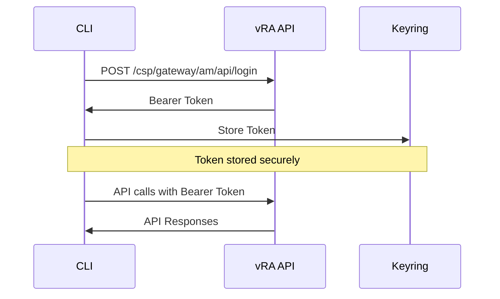

# Authentication

VMware vRA CLI uses secure authentication methods to interact with your vRA environment. This guide covers all authentication options and best practices.

## Authentication Methods

### Token-based Authentication (Recommended)

The CLI uses bearer tokens for API authentication, which are securely stored in your system keyring.

```bash
# Authenticate and store token
vra auth login
```

You'll be prompted for:
- **Username**: Your vRA username (e.g., `admin@vsphere.local`)
- **Password**: Your vRA password (hidden input)
- **URL**: Your vRA server URL (e.g., `https://vra.company.com`)
- **Tenant**: Your vRA tenant (default: `vsphere.local`)

### Environment Variables

For automation and CI/CD scenarios:

```bash
export VRA_URL="https://vra.company.com"
export VRA_TENANT="vsphere.local"
export VRA_USERNAME="service-account@company.com"
# Note: Avoid setting passwords in environment variables
```

## Authentication Commands

### Login

```bash
# Interactive login
vra auth login

# Non-interactive with parameters
vra auth login --username admin@vsphere.local --url https://vra.company.com

# Login to specific tenant
vra auth login --tenant prod.local
```

### Check Status

```bash
vra auth status
```

Output:
```
✅ Authenticated
```

### Logout

```bash
vra auth logout
```

This clears your stored authentication token.

## Security Features

### Secure Token Storage

Tokens are stored securely using your system's keyring:

- **macOS**: Keychain
- **Windows**: Credential Manager  
- **Linux**: Secret Service (GNOME Keyring, KWallet)

### Token Expiration

Tokens have configurable expiration times:

```bash
# Check token expiration (if supported)
vra auth status --verbose
```

### SSL/TLS Configuration

By default, SSL verification is enabled:

```bash
# For development with self-signed certificates
export VRA_VERIFY_SSL="false"

# Or use command line flag
vra --no-verify-ssl catalog list
```

!!! warning "Production Security"
    Never disable SSL verification in production environments.

## Multi-Environment Support

### Using Profiles

Manage multiple vRA environments:

```bash
# Create profiles
vra profile create production \
  --url https://vra-prod.company.com \
  --tenant prod.local

vra profile create development \
  --url https://vra-dev.company.com \
  --tenant dev.local

# Switch between profiles
vra profile use production
vra profile use development

# List profiles
vra profile list

# Show current profile
vra profile current
```

### Environment-Specific Configuration

```bash
# Production environment
export VRA_PROFILE="production"
export VRA_URL="https://vra-prod.company.com"
export VRA_TENANT="prod.local"

# Development environment
export VRA_PROFILE="development"
export VRA_URL="https://vra-dev.company.com"
export VRA_TENANT="dev.local"
```

## Authentication Workflow



## Troubleshooting

### Common Authentication Issues

#### Invalid Credentials

```bash
❌ Authentication failed: 401 Unauthorized
```

**Solutions**:
- Verify username and password
- Check if account is locked
- Confirm correct tenant

#### SSL Certificate Issues

```bash
❌ Authentication failed: SSL: CERTIFICATE_VERIFY_FAILED
```

**Solutions**:
```bash
# For development only
export VRA_VERIFY_SSL="false"

# Or provide custom CA certificate
export VRA_CA_CERT="/path/to/ca-cert.pem"
```

#### Network Connectivity

```bash
❌ Authentication failed: Connection timeout
```

**Solutions**:
- Check network connectivity
- Verify vRA URL is accessible
- Check firewall rules

#### Token Storage Issues

```bash
⚠️ Warning: Could not store token securely
```

**Solutions**:
- Ensure keyring service is running
- Check permissions
- Install keyring dependencies

### Advanced Troubleshooting

#### Debug Mode

Enable verbose logging:

```bash
vra --verbose auth login
```

#### Manual Token Management

If keyring is unavailable:

```bash
# Get token manually and set as environment variable
TOKEN=$(curl -X POST https://vra.company.com/csp/gateway/am/api/login \
  -H "Content-Type: application/json" \
  -d '{"username":"user","password":"pass"}' | jq -r '.access_token')

export VRA_TOKEN="$TOKEN"
```

## Best Practices

### Security

1. **Use Service Accounts**: For automation, create dedicated service accounts
2. **Token Rotation**: Regularly rotate authentication tokens
3. **Environment Isolation**: Use separate accounts for dev/prod environments
4. **Audit Logging**: Monitor authentication events

### Automation

1. **CI/CD Integration**: Use environment variables in pipelines
2. **Secret Management**: Store credentials in secure secret managers
3. **Token Caching**: Leverage token storage for performance

### Development

1. **Profile Management**: Use profiles for different environments
2. **SSL Configuration**: Properly configure SSL for development
3. **Error Handling**: Implement proper error handling in scripts

## API Reference

### Authentication Endpoints

| Endpoint | Method | Description |
|----------|--------|-------------|
| `/csp/gateway/am/api/login` | POST | Authenticate and get token |
| `/csp/gateway/am/api/logout` | POST | Invalidate token |
| `/csp/gateway/am/api/userinfo` | GET | Get user information |

### Token Format

Bearer tokens are JWT tokens with the following structure:

```json
{
  "header": {
    "alg": "RS256",
    "typ": "JWT"
  },
  "payload": {
    "sub": "user@company.com",
    "iss": "https://vra.company.com",
    "exp": 1640995200,
    "iat": 1640908800,
    "tenant": "vsphere.local"
  }
}
```

For more advanced authentication scenarios, see the [CLI Reference](cli-reference.md).
